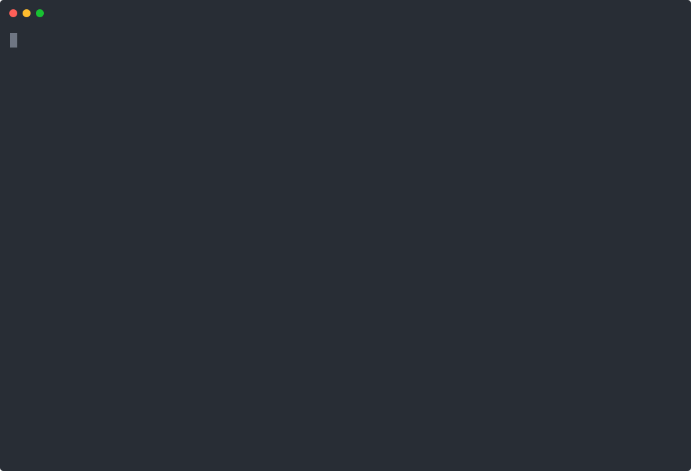

# Actionbase

**One database for user–user, user–item, and item–item interactions — precomputed at write time, served as simple lookups.**<br />
**1M+ req/min in production at Kakao. Built on HBase.**

[](https://github.com/kakao/actionbase/actions/workflows/continuous-integration.yml) [](https://github.com/kakao/actionbase/releases) [](https://opensource.org/licenses/Apache-2.0) [](https://actionbase.io)

[Documentation](https://actionbase.io) · [Open-sourced](https://actionbase.io/blog/open-source-announcement/) · [Why we built this](https://github.com/kakao/actionbase/issues/358) · [Production stories](https://actionbase.io/stories/kakaotalk-gift-wish/)

## Why Actionbase

Follows, likes, recent views, related content — they are all **interaction data**. They look simple, but at scale, real-time counts, toggle consistency, and ordered relationship reads turn into bottlenecks, and teams end up rebuilding caches, indexes, and dual-write pipelines from scratch every time.

Actionbase consolidates these into **one database for interactions**. Every interaction is expressed in the same model — *source → action → target* — and the combination of source and target naturally yields three axes:

- **User–User (U2U)** — follow/unfollow, follower/following counts, timeline scans
- **User–Item (U2I)** — likes/bookmarks, view history, bidirectional counters
- **Item–Item (I2I)** — related products, similar-content graphs, and other precomputed item-to-item relations

All three axes have run in production at Kakao at over 1M req/min since 2024.

## Quick Start

**1. Run**

```bash
docker run -it ghcr.io/kakao/actionbase:standalone
```
Runs server (port 8080) in the background, CLI (`actionbase>`) in the foreground.

**2. Load sample data**

```
load preset likes
```
Loads metadata and 3 edges (a U2I example):
```
Alice --- likes ----> +--------+
                      | Phone  |
Bob ----- likes ----> +--------+
      |
      |               +--------+
      +-- likes ----> | Laptop |
                      +--------+
```

**3. Query** — Precomputed. Just read.

```
get --source Alice --target Phone                # Alice → Phone
scan --index recent --start Bob --direction OUT  # Bob → Laptop, Bob → Phone
scan --index recent --start Phone --direction IN # Alice → Phone, Bob → Phone
count --start Alice --direction OUT              # 1
count --start Phone --direction IN               # 2
```

<a href="https://actionbase.io/quick-start/">
  
</a>

See [Quick Start](https://actionbase.io/quick-start/) for more, or [Build Your Social Media App](https://actionbase.io/guides/build-your-social-media-app/) to go deeper.

## How It Works

- **At write time**: exact counts, consistent toggles, indexes, and aggregations are all precomputed.
- **At read time**: precomputed results are read as-is. Read-path cost stays flat under load. Multi-hop traversals are expressed by composing the supported operations.

Supported operations:

* Edge lookups (GET, multi-get)
* Edge counts (COUNT)
* Indexed edge scans (SCAN; multi-start variant is SEEK)
* Real-time aggregations (AGG)

Planned:

* Global TopK
* Per-entity TopK

## Architecture

- **HBase** — durable storage for interactions; strong durability, horizontal scalability.
- **Kafka** — WAL/CDC publication for recovery, replay, and downstream pipelines.
- **JDBC metastore** — to be consolidated into HBase.

```
Client
  │
(REST API)
  │
Actionbase
  ├──> HBase
  │
  ├──> JDBC
  │
  └──> Kafka ──> Downstream Pipelines
```

Additional storage backends are planned for small to mid-size deployments.

## Codebase Overview

* **core** — data model, mutation, query, encoding logic (Java, Kotlin)
* **engine** — storage and messaging bindings (Kotlin)
* **server** — REST API server (Kotlin, Spring WebFlux)
* **pipeline** *(planned)* — bulk loading and CDC processing (Scala, Spark)

## When to Use It

- A single database or cache layer can no longer absorb your U2U/U2I/I2I traffic
- Multiple teams keep rebuilding the same real-time counters, sync queues, and relationship scans
- You need predictable read latency without read-time computation

If a single database can handle your workload, that's the better choice.

## Current Status

Early open-source phase. The first release focuses on introducing core concepts and hands-on guides. Production installation, operations guides, and additional components will be released over time.

## Contribute

We welcome contributions. See our [Contributing Guide](CONTRIBUTING.md).

For questions, ideas, or feedback, open an [issue](https://github.com/kakao/actionbase/issues).

## Learn More

* [Documentation](https://actionbase.io/)
* [Roadmap](ROADMAP.md)
* [Actionbase at if(kakaoAI) 2024](https://www.youtube.com/watch?v=8-hVAFVHISE) (YouTube, Korean)

## License

This software is licensed under the [Apache 2 license](LICENSE).

Copyright 2026 Kakao Corp. <http://www.kakaocorp.com>

Licensed under the Apache License, Version 2.0 (the "License"); you may not
use this project except in compliance with the License. You may obtain a copy
of the License at http://www.apache.org/licenses/LICENSE-2.0.

Unless required by applicable law or agreed to in writing, software
distributed under the License is distributed on an "AS IS" BASIS, WITHOUT
WARRANTIES OR CONDITIONS OF ANY KIND, either express or implied. See the
License for the specific language governing permissions and limitations under
the License.

