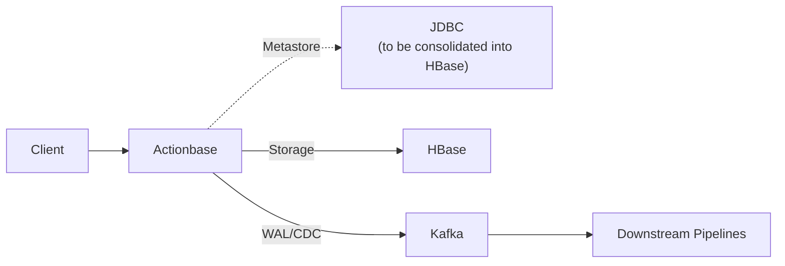

# Actionbase

> 🚀 **Open-sourced** — [Learn more](https://actionbase.io/blog/open-source-announcement/)

Actionbase is a database for serving user interactions. Built because we kept rebuilding likes, views, and follows across teams—and because a single database stopped scaling.

For background on why it exists and the problems it addresses, see [the discussion](https://github.com/kakao/actionbase/discussions/32).

## What You Can Build

- Like buttons and reaction counts
- "Recently viewed" lists
- Follow/following feeds
- Per-user interaction histories

## What Actionbase Is (and Isn't)

| Focuses on | Explicitly avoids |
|------------|-------------------|
| Real-time user interactions (likes, views, follows) | General-purpose graph queries |
| Bounded access patterns (GET, COUNT, SCAN) | Unbounded traversal or analytics |
| Continuous writes, immediate reads | Batch ingestion or deferred indexing |
| WAL/CDC to Kafka (yours or ours) | Owning downstream processing |
| Pluggable storage (HBase now, others planned) | Building yet another storage engine |

If a single well-tuned database handles your workload, that's probably the better answer. Actionbase exists for cases where interaction features are rebuilt repeatedly across teams, and the cost of fragmentation outweighs the cost of a dedicated system.

## Getting Started

- **Quick Start**  
  Get Actionbase running quickly with minimal setup.  
  → https://actionbase.io/quick-start/

- **Hands-on Guide: Build Your Social Media App**  
  A step-by-step guide that walks through modeling and serving real-world user interactions.  
  → https://actionbase.io/guides/build-your-social-media-app/

## What It Does

Actionbase serves interaction-derived data—**likes**, **recent views**, **reactions**, **follows**—that power product listings, feeds, and other interaction-driven surfaces.

User interactions are modeled as **who** did **what** to which **target**. Actionbase materializes read-optimized structures at write time, enabling fast and predictable queries without expensive read-time computation.

Actionbase leverages proven storage engines—currently HBase for durability and horizontal scalability (lighter backends planned for smaller deployments). Built-in WAL and CDC publish to Kafka for downstream pipelines.

## Production Usage

Used at Kakao across services including [KakaoTalk](https://www.kakaocorp.com/page/service/service/KakaoTalk) and [Kakao Gift](https://gift.kakao.com/home) (KR, e.g., the heart buttons on product lists)—serving tens of millions of users, handling over 1M requests/min at peak, on multi-terabyte datasets. Running in stable production for years.

## Learn More

- [Documentation](https://actionbase.io/)
- [Introduction to Actionbase (Korean) / if(kakaoAI) 2024](https://www.youtube.com/watch?v=8-hVAFVHISE)

## Contributing

We welcome contributions. See our [Contributing](https://actionbase.io/community/contributing/) page.

## Current Status

The codebase is released largely as it evolved inside Kakao, with sensitive details removed. Some internal modules and operational guides—including Kubernetes and HBase—will be added in future releases.

## Architecture

### Codebase

- **core** — Data model, mutation, query, and encoding logic (Java, Kotlin)
- **engine** — Binds core to storage (HBase) and messaging (Kafka) (Kotlin)
- **server** — REST API server (Kotlin, Spring WebFlux)
- **pipeline** *(planned)* — Bulk loading, WAL/CDC processing, and more (Scala, Spark)

## License

This software is licensed under the [Apache 2 license](LICENSE).

Copyright 2026 Kakao Corp. <http://www.kakaocorp.com>

Licensed under the Apache License, Version 2.0 (the "License"); you may not
use this project except in compliance with the License. You may obtain a copy
of the License at http://www.apache.org/licenses/LICENSE-2.0.

Unless required by applicable law or agreed to in writing, software
distributed under the License is distributed on an "AS IS" BASIS, WITHOUT
WARRANTIES OR CONDITIONS OF ANY KIND, either express or implied. See the
License for the specific language governing permissions and limitations under
the License.
