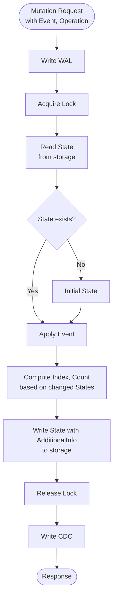

Mutations in Actionbase allow you to insert, update, and delete vertices and edges in your graph database. The mutation process follows a carefully orchestrated sequence to ensure data consistency, durability, and write-time optimization.

## Mutation Flow

The following diagram illustrates the complete mutation process:

## Mutation Request

A mutation request contains:
- **Event**: The data change to be applied (e.g., new property values, edge creation)
- **Operation**: The type of operation to perform:
  - **Insert**: Create a new vertex or edge
  - **Update**: Modify an existing vertex or edge
  - **Delete**: Remove a vertex or edge

## Mutation Process Steps

### 1. Write WAL (Write-Ahead Log)

Before any changes are made to the storage, the mutation is first written to the Write-Ahead Log (WAL). This ensures durability and allows for recovery in case of failures. The WAL serves as a persistent record of all mutations before they are applied to the actual data. In production, Actionbase uses Kafka as the WAL backend.

### 2. Acquire Lock

To prevent concurrent modifications that could lead to data inconsistencies, Actionbase acquires a lock on the specific edge or vertex being mutated. This ensures that only one mutation can modify a particular piece of data at a time.

For edges, the locking mechanism depends on the edge type:
- **Unique edges**: Locks are acquired based on the (source, target) pair
- **Multi edges**: Locks are acquired based on the edge ID

### 3. Read State

The current state of the vertex or edge is read from storage. This includes all existing properties, timestamps, and metadata associated with the entity.

### 4. Apply Event or Initialize State

- **If state exists**: The event is applied to the existing state, transitioning it to a new state based on the operation type.
- **If state doesn't exist**: An initial state is created, and then the event is applied to it.

This step performs the actual state transition in memory. The transition behavior depends on the operation type:

- **INSERT**: Updates `createdAt` timestamp and sets properties from the event. The state becomes active when `createdAt > deletedAt`.
- **UPDATE**: Updates only the properties specified in the event, without changing timestamps.
- **DELETE**: Updates `deletedAt` timestamp and marks all properties as deleted. The state becomes inactive when `deletedAt >= createdAt`.

The transition respects version ordering (newer versions override older ones) and maintains state consistency.

### 5. Compute Additional Information (Write-time Optimization)

Based on the changed state, Actionbase computes additional information that enables fast read operations:

- **Indexes**: Existing indexes are deleted, and new or updated indexes are created based on the changed state
- **Counters**: Counts are incremented or decremented to maintain aggregate statistics

This write-time optimization ensures that read queries can be answered quickly without expensive computations at query time.

### 6. Write State with Additional Information

The modified state along with all computed additional information (indexes, counters, etc.) is written to storage. This atomic write ensures that the state and its associated optimization data are always consistent.

### 7. Release Lock

Once the write is complete, the lock is released, allowing other mutations to proceed on the same or different entities.

### 8. Write CDC (Change Data Capture)

The mutation is recorded in the Change Data Capture (CDC) system, which enables downstream systems to react to data changes in real-time. This is done asynchronously to avoid impacting mutation latency. In production, Actionbase uses Kafka as the CDC backend.

### 9. Response

The mutation operation completes and returns a response indicating the success or failure of the operation, along with any relevant metadata about the mutation.

## Write-time Optimization

Actionbase's write-time optimization is a key feature that pre-computes indexes and counters during mutations. This design choice provides several benefits:

- **Fast Reads**: Read operations can be answered quickly without expensive query-time computations
- **Consistent Performance**: Read latency remains consistently low (`<5ms p99`) regardless of data size
- **Efficient Storage**: Indexes and counters are maintained incrementally, avoiding full scans

By computing additional information at write time, Actionbase shifts the computational cost from read operations to write operations, which is ideal for read-heavy workloads.

## Consistency Guarantees

The mutation process ensures data consistency through:

- **Locking**: Prevents concurrent modifications to the same entity
- **Atomic Writes**: State and additional information are written atomically
- **WAL**: Ensures durability and enables recovery
- **Read-Modify-Write**: Ensures that mutations are based on the latest state

