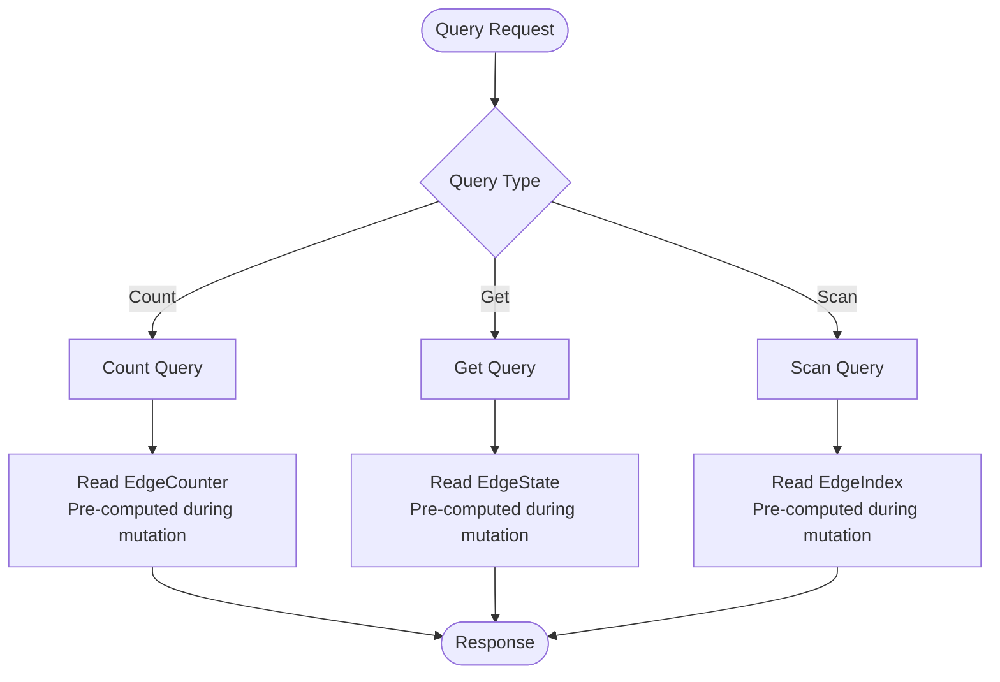

Queries in Actionbase retrieve data that was pre-computed and optimized during mutations. The query system is designed to access these pre-computed structures directly, providing ultra-fast read operations with consistent low latency.

## Query Philosophy

Actionbase queries are designed to read the optimized data structures created during mutations. When you perform a mutation, Actionbase pre-computes:

- **EdgeState**: The current state of edges for direct retrieval
- **EdgeIndex**: Sorted index entries for efficient range scans
- **EdgeCounter**: Aggregated counts for fast counting operations

Queries access these pre-computed structures directly. You explicitly choose the query type (Count, Get, or Scan) and specify the index to use, ensuring that each query follows an optimized path that was prepared during write time.

## Query Types

Actionbase supports three types of edge queries, each designed to access specific pre-computed data structures:

- **Count**: Accesses pre-computed counters to retrieve the number of edges
- **Get**: Directly retrieves edge state by source and target node IDs
- **Scan**: Uses a pre-computed index to scan edges with range filtering and pagination

Each query type requires you to explicitly specify the access pattern, ensuring that queries follow the optimized paths created during mutations.

## Query Flow

The following diagram illustrates how queries access pre-computed data:



## Query Processing

### Count Query

Count queries read pre-computed counter values that were maintained during mutations. When an edge is created or deleted, the corresponding counter is automatically updated.

**Processing Steps:**
1. Construct the EdgeCounter row key based on the source node, table, and direction
2. Retrieve the pre-computed counter value from storage
3. If ranges are specified, scan the index entries and count matching edges
4. Return the count value

**Storage Access:**
- Reads from **EdgeCounter** row type (Row Type Code: -2), created during mutations
- Key structure: `[hash] + [source] + [table] + [-2] + [direction]`
- Value: Pre-computed edge count maintained incrementally

### Get Query

Get queries directly access edge state that was written during mutations. Each mutation updates the EdgeState, and Get queries retrieve this state by constructing the exact row key.

**Processing Steps:**
1. For each (source, target) pair, construct the EdgeState row key
2. Retrieve the edge state directly from storage
3. Apply optional filters to the retrieved edges
4. Return the matching edges

**Storage Access:**
- Reads from **EdgeState** row type (Row Type Code: -3), written during mutations
- Key structure: `[hash] + [source] + [table] + [-3] + [target]`
- Value: Edge state including properties, version, timestamps - exactly as written during mutation

**MGet Support:**
- When multiple source or target IDs are specified, the operation behaves as a multi-get (mget)
- Maximum of 25 edges can be retrieved per API request
- Supports 1 source with N targets, or M sources with 1 target patterns

### Scan Query

Scan queries use pre-computed index entries that were created during mutations. You must explicitly specify which index to use, and the query will scan the entries that were sorted and stored when edges were written.

**Processing Steps:**
1. Construct the EdgeIndex row key prefix based on source, table, direction, and the specified index
2. Apply range filters to determine the scan start and end points within the index
3. Perform a range scan on the pre-computed index entries
4. Apply optional filters to the scanned results
5. Apply pagination (limit, offset) if specified
6. Return the matching edges

**Storage Access:**
- Reads from **EdgeIndex** row type (Row Type Code: -4), created during mutations
- Key structure: `[hash] + [source] + [table] + [-4] + [direction] + [index] + [index values] + [target]`
- Value: Edge version and properties, stored in sorted order based on index definition

**Index Requirement:**
- You must explicitly specify which index to use in the query
- The index must have been defined in the table metadata
- Index entries are created and maintained automatically during mutations

## Querying Pre-computed Data

Actionbase's query performance comes from reading data structures that were optimized during mutations. This design means:

- **No Query-time Computation**: Queries simply retrieve pre-computed data from storage
- **Explicit Access Patterns**: You choose the query type and index, ensuring queries follow prepared paths
- **Consistent Structure**: The data structure you query is exactly what was created during mutation

### Benefits

- **Fast Reads**: Read operations retrieve pre-computed data without expensive computations
- **Consistent Performance**: Read latency remains consistently low (`<5ms p99`) regardless of data size
- **Predictable Performance**: Since queries follow explicit, pre-computed paths, performance is predictable

## Index Ranges

When using Scan queries, you can specify ranges to filter data. Ranges work with the pre-computed index structure, allowing efficient filtering at the storage level.

### Key Concepts

- **Explicit Index Use**: You must specify which index to use, and ranges can only use fields included in that index
- **Index Structure**: Ranges leverage the sorted structure of index entries created during mutations
- **Operator Semantics**: Operators (`eq`, `gt`, `lt`, `between`) determine the scan start and end points within the sorted index
- **Index Order**: For composite indexes, ranges must be applied in the order of fields defined in the index
- **Sort Direction**: The meaning of operators depends on whether the index is ASC (ascending) or DESC (descending)

### Range vs Filter

- **Ranges**: Work with the pre-computed index structure, filtering at the storage level using indexed fields
- **Filters**: Applied after retrieval, can use any field but don't benefit from index optimization

## Pagination

Scan queries support pagination through the `offset` and `limit` parameters:

- **offset**: Encoded string indicating the starting position within the index
- **limit**: Maximum number of results to return (default: 25)
- **hasNext**: Boolean indicating whether more results are available

Pagination works with the sorted index structure, enabling efficient retrieval of large result sets.

## Query Direction

Queries support two directions:

- **OUT**: Outgoing direction (e.g., retrieving products that a user liked)
- **IN**: Incoming direction (e.g., retrieving users who liked a product)

The direction determines which pre-computed data structures are accessed, as separate index entries and counters are maintained for each direction during mutations.

## Read Path

The complete read path in Actionbase:

```
Client → Server → Engine → HBase → Response
```

1. **Client**: Sends query request via REST API, explicitly specifying query type and parameters
2. **Server**: Receives and validates the request
3. **Engine**: Constructs the storage key based on the query type and parameters, then retrieves pre-computed data
4. **HBase**: Returns the pre-computed data structure (EdgeState, EdgeIndex, or EdgeCounter) created during mutations
5. **Response**: Returns formatted results to the client

This simple read path accesses data structures that were optimized during write time, ensuring consistent low-latency query performance.
