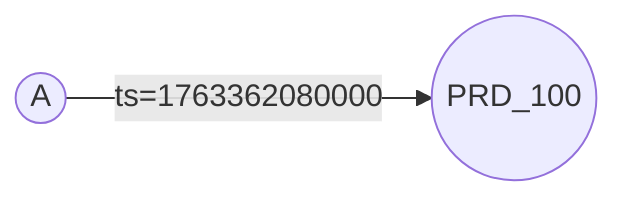
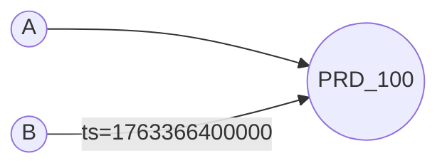
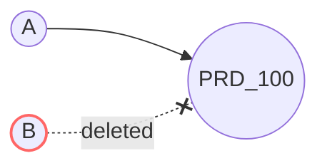

This document illustrates how data structures change with **aggregation**.

| | Edge documents | Aggregation |
|---|---|---|
| **Data structures** | EdgeState, EdgeIndex, EdgeCount | + **EdgeGroup** |
| **Purpose** | Store edges | Time-bucketed counters |
| **Use case** | Relationships | "N users viewing now" |

## Schema

```
[Table] recently_view_product_v1
+--------+-----------+-----------+----------------+
| source | target    | direction | index          |
+--------+-----------+-----------+----------------+
| userId | productId | BOTH      | created_at_desc|
+--------+-----------+-----------+----------------+
```

- **source**: User ID performing the action
- **target**: Product ID being viewed
- **direction**: `BOTH` means both OUT and IN indexes are maintained
- **index**: `created_at_desc` orders edges by creation time (descending)

### Groups Definition

```
+-------+-------+-----------+-----------+------------+------------------+------------------+-------------------+----------------------+---------------------+
| group | type  | direction | ttl       | field.name | field.bucket.type| field.bucket.name| field.bucket.unit | field.bucket.timezone| field.bucket.format |
+-------+-------+-----------+-----------+------------+------------------+------------------+-------------------+----------------------+---------------------+
| hour  | COUNT | IN        | 691200000 | createdAt  | date             | time             | MILLISECOND       | +09:00               | yyyyMMdd'T'HH       |
+-------+-------+-----------+-----------+------------+------------------+------------------+-------------------+----------------------+---------------------+
```

### Group Configuration

| Key | Value | Description |
|-----|-------|-------------|
| type | COUNT | Aggregation type: `COUNT` or `SUM` |
| direction | IN | Direction for grouping. `IN` groups by target (productId) |
| ttl | 691200000 | Data retention in milliseconds (default: 8 days) |
| field.name | createdAt | Field to use for grouping (`properties.createdAt`) |
| field.bucket.type | date | Bucket type. Date-based bucketing |
| field.bucket.name | time | Bucket name |
| field.bucket.unit | MILLISECOND | Time unit: `NANOSECOND`, `MICROSECOND`, `MILLISECOND`, `SECOND` |
| field.bucket.timezone | +09:00 | Timezone for bucketing (KST = GMT+09:00) |
| field.bucket.format | yyyyMMdd'T'HH | Bucket format. Stores time as `yyyyMMdd'T'HH` |

---

## Action 1: A views product 100

User A views product 100 at timestamp `1763362080000` (2025-11-17 07:00:00 KST).



### Edge State

| source | target | active | version                          | properties              | created_at      | deleted_at |
|--------|--------|--------|----------------------------------|------------------------|-----------------|------------|
| A      | 100    | true   | 1763362080000 (2025-11-17 07:00:00) | createdAt=1763362080000 | 1763362080000   | null       |

### Edge Index

| source | direction | indexCode                    | target | version                          |
|--------|-----------|------------------------------|--------|----------------------------------|
| A      | OUT       | -373869625 (created_at_desc) | 100    | 1763362080000 (2025-11-17 07:00:00) |
| 100    | IN        | -373869625 (created_at_desc) | A      | 1763362080000 (2025-11-17 07:00:00) |

### Edge Count

| source | direction | count |
|--------|-----------|-------|
| A      | OUT       | 1     |
| 100    | IN        | 1     |

### Edge Group

| source | direction | groupCode | groupValue  | accumulator |
|--------|-----------|-----------|-------------|-------------|
| 100    | IN        | hour      | 20251117T07 | 1           |

---

## Action 2: B views product 100

User B views product 100 at timestamp `1763366400000` (2025-11-17 08:00:00 KST). This is a different hour bucket than Action 1.



### Edge State

| source | target | active | version                          | properties              | created_at      | deleted_at |
|--------|--------|--------|----------------------------------|------------------------|-----------------|------------|
| A      | 100    | true   | 1763362080000 (2025-11-17 07:00:00) | createdAt=1763362080000 | 1763362080000   | null       |
| B      | 100    | true   | 1763366400000 (2025-11-17 08:00:00) | createdAt=1763366400000 | 1763366400000   | null       |

### Edge Index

| source | direction | indexCode                    | target | version                          |
|--------|-----------|------------------------------|--------|----------------------------------|
| A      | OUT       | -373869625 (created_at_desc) | 100    | 1763362080000 (2025-11-17 07:00:00) |
| 100    | IN        | -373869625 (created_at_desc) | A      | 1763362080000 (2025-11-17 07:00:00) |
| B      | OUT       | -373869625 (created_at_desc) | 100    | 1763366400000 (2025-11-17 08:00:00) |
| 100    | IN        | -373869625 (created_at_desc) | B      | 1763366400000 (2025-11-17 08:00:00) |

### Edge Count

| source | direction | count |
|--------|-----------|-------|
| A      | OUT       | 1     |
| 100    | IN        | 2     |
| B      | OUT       | 1     |

### Edge Group

| source | direction | groupCode | groupValue  | accumulator |
|--------|-----------|-----------|-------------|-------------|
| 100    | IN        | hour      | 20251117T08 | 1           |
| 100    | IN        | hour      | 20251117T07 | 1           |

> Note: A new bucket `20251117T08` is created for the 08:00 hour. Each hour has its own accumulator.

---

## Action 3: B deletes the view record

User B deletes the view record at timestamp `1763370000000` (2025-11-17 09:00:00 KST).



### Edge State

| source | target | active | version                          | properties              | created_at      | deleted_at      |
|--------|--------|--------|----------------------------------|------------------------|-----------------|-----------------|
| A      | 100    | true   | 1763362080000 (2025-11-17 07:00:00) | createdAt=1763362080000 | 1763362080000   | null            |
| B      | 100    | false  | 1763370000000 (2025-11-17 09:00:00) | createdAt=1763370000000 | 1763366400000   | 1763370000000   |

### Edge Index

| source | direction | indexCode                    | target | version                          |
|--------|-----------|------------------------------|--------|----------------------------------|
| A      | OUT       | -373869625 (created_at_desc) | 100    | 1763362080000 (2025-11-17 07:00:00) |
| 100    | IN        | -373869625 (created_at_desc) | A      | 1763362080000 (2025-11-17 07:00:00) |
| ~~B~~  | ~~OUT~~   | ~~(deleted)~~                | ~~100~~ | ~~-~~                           |
| ~~100~~| ~~IN~~    | ~~(deleted)~~                | ~~B~~  | ~~-~~                           |

### Edge Count

| source | direction | count |
|--------|-----------|-------|
| A      | OUT       | 1     |
| 100    | IN        | 1     |
| B      | OUT       | 0     |

### Edge Group

| source | direction | groupCode | groupValue  | accumulator |
|--------|-----------|-----------|-------------|-------------|
| 100    | IN        | hour      | 20251117T08 | 0           |
| 100    | IN        | hour      | 20251117T07 | 1           |

> Note: The `20251117T08` bucket's accumulator is decremented to 0. The bucket remains but with zero count.

---

## Key Points

1. **Edge Group**: A new data structure for time-based aggregations. It stores pre-computed counts/sums grouped by time buckets.

2. **Bucket Format**: The `groupValue` is formatted according to `field.bucket.format`. In this example, `20251117T07` represents 2025-11-17 07:00 hour.

3. **Direction-Based Grouping**: With `direction: IN`, the group is keyed by target (product). This enables queries like "How many users viewed this product in the last hour?"

4. **TTL**: Groups have a TTL (time-to-live) to automatically expire old data. Default is 8 days (691200000 ms).

5. **Aggregation Types**:
   - `COUNT`: Counts the number of edges
   - `SUM`: Sums a numeric property value

6. **Bucket Isolation**: Each time bucket maintains its own accumulator. Different hours create separate bucket entries.

7. **Delete Behavior**: When an edge is deleted, the corresponding bucket's accumulator is decremented. The bucket entry remains even with zero count.

### Use Cases

- **Real-time view counters**: "N users are viewing this product now"
- **Hourly/daily statistics**: "Products viewed in the last hour"
- **Trending detection**: Track activity spikes in time windows

For details on encoding, see [Data Encoding](/internals/encoding/).

