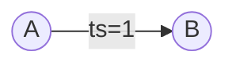
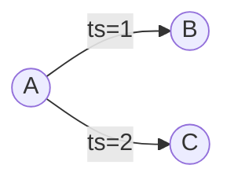
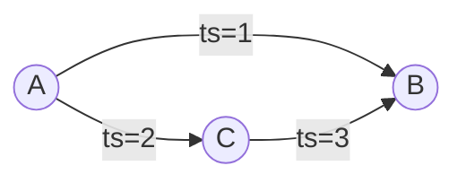
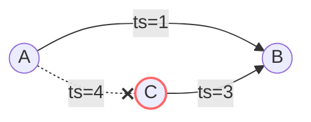
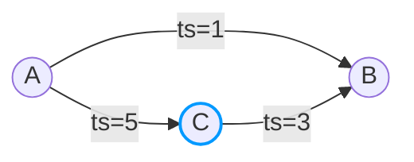

This document illustrates how data structures change with **both-directed edges**.

| | Both-Directed | [Out-Directed](/internals/explained/edge-out-directed/) | [Multi-Edge](/internals/explained/multi-edge/) |
|---|---|---|---|
| **Direction** | BOTH | OUT | BOTH/OUT |
| **Index** | OUT + IN | OUT only | OUT + IN (by id) |
| **Key** | (source, target) | (source, target) | id |
| **Use case** | Follows, friends | Recent views | Gifts, orders |

## Schema

```
[Table] friend_v1
+--------+----------+-----------+----------------+
| source | target   | direction | index          |
+--------+----------+-----------+----------------+
| userId | friendId | BOTH      | created_at_desc|
+--------+----------+-----------+----------------+
```

- **source**: User ID performing the action
- **target**: Friend ID being added
- **direction**: `BOTH` means both OUT and IN indexes are maintained
- **index**: `created_at_desc` orders edges by creation time (descending)

---

## Action 1: A adds B as a friend

A adds B as a friend at timestamp 1.



### Edge State

| source | target | active | version | properties   | created_at | deleted_at |
|--------|--------|--------|---------|--------------|------------|------------|
| A      | B      | true   | 1       | createdAt=1  | 1          | null       |

### Edge Index

| source | direction | indexCode                    | target | version |
|--------|-----------|------------------------------|--------|---------|
| A      | OUT       | -373869625 (created_at_desc) | B      | 1       |
| B      | IN        | -373869625 (created_at_desc) | A      | 1       |

### Edge Count

| source | direction | count |
|--------|-----------|-------|
| A      | OUT       | 1     |
| B      | IN        | 1     |

---

## Action 2: A adds C as a friend

A adds C as a friend at timestamp 2. The previous edge (A→B) remains.



### Edge State

| source | target | active | version | properties   | created_at | deleted_at |
|--------|--------|--------|---------|--------------|------------|------------|
| A      | B      | true   | 1       | createdAt=1  | 1          | null       |
| A      | C      | true   | 2       | createdAt=2  | 2          | null       |

### Edge Index

| source | direction | indexCode                    | target | version |
|--------|-----------|------------------------------|--------|---------|
| A      | OUT       | -373869625 (created_at_desc) | B      | 1       |
| B      | IN        | -373869625 (created_at_desc) | A      | 1       |
| A      | OUT       | -373869625 (created_at_desc) | C      | 2       |
| C      | IN        | -373869625 (created_at_desc) | A      | 2       |

### Edge Count

| source | direction | count |
|--------|-----------|-------|
| A      | OUT       | 2     |
| B      | IN        | 1     |
| C      | IN        | 1     |

---

## Action 3: C adds B as a friend

C adds B as a friend at timestamp 3. Now B has two incoming edges (from A and C).



### Edge State

| source | target | active | version | properties   | created_at | deleted_at |
|--------|--------|--------|---------|--------------|------------|------------|
| A      | B      | true   | 1       | createdAt=1  | 1          | null       |
| A      | C      | true   | 2       | createdAt=2  | 2          | null       |
| C      | B      | true   | 3       | createdAt=3  | 3          | null       |

### Edge Index

| source | direction | indexCode                    | target | version |
|--------|-----------|------------------------------|--------|---------|
| A      | OUT       | -373869625 (created_at_desc) | B      | 1       |
| B      | IN        | -373869625 (created_at_desc) | A      | 1       |
| A      | OUT       | -373869625 (created_at_desc) | C      | 2       |
| C      | IN        | -373869625 (created_at_desc) | A      | 2       |
| C      | OUT       | -373869625 (created_at_desc) | B      | 3       |
| B      | IN        | -373869625 (created_at_desc) | C      | 3       |

### Edge Count

| source | direction | count |
|--------|-----------|-------|
| A      | OUT       | 2     |
| B      | IN        | 2     |
| C      | IN        | 1     |
| C      | OUT       | 1     |

---

## Action 4: A removes C as a friend

A removes C as a friend at timestamp 4. The edge is marked as deleted (active=false), and the corresponding indexes are removed.



### Edge State

| source | target | active | version | properties     | created_at | deleted_at |
|--------|--------|--------|---------|----------------|------------|------------|
| A      | B      | true   | 1       | createdAt=1    | 1          | null       |
| A      | C      | false  | 4       | createdAt=null | 2          | 4          |
| C      | B      | true   | 3       | createdAt=3    | 3          | null       |

### Edge Index

| source | direction | indexCode                    | target | version |
|--------|-----------|------------------------------|--------|---------|
| A      | OUT       | -373869625 (created_at_desc) | B      | 1       |
| B      | IN        | -373869625 (created_at_desc) | A      | 1       |
| ~~A~~  | ~~OUT~~   | ~~(deleted)~~                | ~~C~~  | ~~-~~   |
| ~~C~~  | ~~IN~~    | ~~(deleted)~~                | ~~A~~  | ~~-~~   |
| C      | OUT       | -373869625 (created_at_desc) | B      | 3       |
| B      | IN        | -373869625 (created_at_desc) | C      | 3       |

### Edge Count

| source | direction | count |
|--------|-----------|-------|
| A      | OUT       | 1     |
| B      | IN        | 2     |
| C      | IN        | 0     |
| C      | OUT       | 1     |

---

## Action 5: A re-adds C as a friend

A re-adds C as a friend at timestamp 5. The previously deleted edge is reactivated with a new version.



### Edge State

| source | target | active | version | properties   | created_at | deleted_at |
|--------|--------|--------|---------|--------------|------------|------------|
| A      | B      | true   | 1       | createdAt=1  | 1          | null       |
| A      | C      | true   | 5       | createdAt=5  | 5          | 4          |
| C      | B      | true   | 3       | createdAt=3  | 3          | null       |

### Edge Index

| source | direction | indexCode                    | target | version |
|--------|-----------|------------------------------|--------|---------|
| A      | OUT       | -373869625 (created_at_desc) | B      | 1       |
| B      | IN        | -373869625 (created_at_desc) | A      | 1       |
| C      | OUT       | -373869625 (created_at_desc) | B      | 3       |
| B      | IN        | -373869625 (created_at_desc) | C      | 3       |
| A      | OUT       | -373869625 (created_at_desc) | C      | 5       |
| C      | IN        | -373869625 (created_at_desc) | A      | 5       |

### Edge Count

| source | direction | count |
|--------|-----------|-------|
| A      | OUT       | 2     |
| B      | IN        | 2     |
| C      | IN        | 1     |
| C      | OUT       | 1     |

---

## Key Points

1. **Both-Directed**: With `direction: BOTH`, every edge creates two index entries—one for OUT queries (from source) and one for IN queries (to target).

2. **Bidirectional Queries**: This enables queries like:
   - "Who are A's friends?" (OUT direction from A)
   - "Who added B as a friend?" (IN direction to B)

3. **Count Maintenance**: Separate counters are maintained for each direction, enabling O(1) count queries in both directions.

4. **Soft Delete**: When an edge is deleted:
   - Edge State: `active` becomes `false`, `deleted_at` is set
   - Edge Index: Corresponding index entries are removed
   - Edge Count: Counters are decremented

5. **Re-Insert**: When a deleted edge is re-added:
   - Edge State: `active` becomes `true`, version and `created_at` are updated, `deleted_at` is preserved (for history)
   - Edge Index: New index entries are created with the new version
   - Edge Count: Counters are incremented

For details on encoding, see [Data Encoding](/internals/encoding/).

