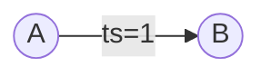
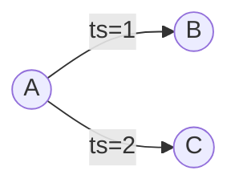
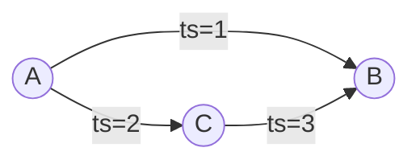
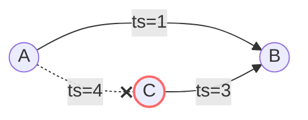
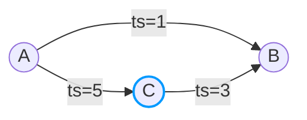

This document illustrates how data structures change with **out-directed edges**.

| | [Both-Directed](/internals/explained/edge-both-directed/) | Out-Directed | [Multi-Edge](/internals/explained/multi-edge/) |
|---|---|---|---|
| **Direction** | BOTH | OUT | BOTH/OUT |
| **Index** | OUT + IN | OUT only | OUT + IN (by id) |
| **Key** | (source, target) | (source, target) | id |
| **Use case** | Follows, friends | Recent views | Gifts, orders |

## Schema

```
[Table] friend_v2
+--------+----------+-----------+----------------+
| source | target   | direction | index          |
+--------+----------+-----------+----------------+
| userId | friendId | OUT       | created_at_desc|
+--------+----------+-----------+----------------+
```

- **source**: User ID performing the action
- **target**: Friend ID being added
- **direction**: `OUT` means only outgoing indexes are maintained
- **index**: `created_at_desc` orders edges by creation time (descending)

---

## Action 1: A adds B as a friend

A adds B as a friend at timestamp 1.



### Edge State

| source | target | active | version | properties   | created_at | deleted_at |
|--------|--------|--------|---------|--------------|------------|------------|
| A      | B      | true   | 1       | createdAt=1  | 1          | null       |

### Edge Index

| source | direction | indexCode                    | target | version |
|--------|-----------|------------------------------|--------|---------|
| A      | OUT       | -373869625 (created_at_desc) | B      | 1       |

### Edge Count

| source | direction | count |
|--------|-----------|-------|
| A      | OUT       | 1     |

---

## Action 2: A adds C as a friend

A adds C as a friend at timestamp 2. The previous edge (A→B) remains.



### Edge State

| source | target | active | version | properties   | created_at | deleted_at |
|--------|--------|--------|---------|--------------|------------|------------|
| A      | B      | true   | 1       | createdAt=1  | 1          | null       |
| A      | C      | true   | 2       | createdAt=2  | 2          | null       |

### Edge Index

| source | direction | indexCode                    | target | version |
|--------|-----------|------------------------------|--------|---------|
| A      | OUT       | -373869625 (created_at_desc) | B      | 1       |
| A      | OUT       | -373869625 (created_at_desc) | C      | 2       |

### Edge Count

| source | direction | count |
|--------|-----------|-------|
| A      | OUT       | 2     |

---

## Action 3: C adds B as a friend

C adds B as a friend at timestamp 3.



### Edge State

| source | target | active | version | properties   | created_at | deleted_at |
|--------|--------|--------|---------|--------------|------------|------------|
| A      | B      | true   | 1       | createdAt=1  | 1          | null       |
| A      | C      | true   | 2       | createdAt=2  | 2          | null       |
| C      | B      | true   | 3       | createdAt=3  | 3          | null       |

### Edge Index

| source | direction | indexCode                    | target | version |
|--------|-----------|------------------------------|--------|---------|
| A      | OUT       | -373869625 (created_at_desc) | B      | 1       |
| A      | OUT       | -373869625 (created_at_desc) | C      | 2       |
| C      | OUT       | -373869625 (created_at_desc) | B      | 3       |

### Edge Count

| source | direction | count |
|--------|-----------|-------|
| A      | OUT       | 2     |
| C      | OUT       | 1     |

---

## Action 4: A removes C as a friend

A removes C as a friend at timestamp 4. The edge is marked as deleted.



### Edge State

| source | target | active | version | properties     | created_at | deleted_at |
|--------|--------|--------|---------|----------------|------------|------------|
| A      | B      | true   | 1       | createdAt=1    | 1          | null       |
| A      | C      | false  | 4       | createdAt=null | 2          | 4          |
| C      | B      | true   | 3       | createdAt=3    | 3          | null       |

### Edge Index

| source | direction | indexCode                    | target | version |
|--------|-----------|------------------------------|--------|---------|
| A      | OUT       | -373869625 (created_at_desc) | B      | 1       |
| ~~A~~  | ~~OUT~~   | ~~(deleted)~~                | ~~C~~  | ~~-~~   |
| C      | OUT       | -373869625 (created_at_desc) | B      | 3       |

### Edge Count

| source | direction | count |
|--------|-----------|-------|
| A      | OUT       | 1     |
| C      | OUT       | 1     |

---

## Action 5: A re-adds C as a friend

A re-adds C as a friend at timestamp 5. The previously deleted edge is reactivated.



### Edge State

| source | target | active | version | properties   | created_at | deleted_at |
|--------|--------|--------|---------|--------------|------------|------------|
| A      | B      | true   | 1       | createdAt=1  | 1          | null       |
| A      | C      | true   | 5       | createdAt=5  | 5          | 4          |
| C      | B      | true   | 3       | createdAt=3  | 3          | null       |

### Edge Index

| source | direction | indexCode                    | target | version |
|--------|-----------|------------------------------|--------|---------|
| A      | OUT       | -373869625 (created_at_desc) | B      | 1       |
| C      | OUT       | -373869625 (created_at_desc) | B      | 3       |
| A      | OUT       | -373869625 (created_at_desc) | C      | 5       |

### Edge Count

| source | direction | count |
|--------|-----------|-------|
| A      | OUT       | 2     |
| C      | OUT       | 1     |

---

## Key Points

1. **Out-Directed Only**: With `direction: OUT`, only outgoing indexes are created. No IN indexes are maintained.

2. **Supported Queries**: This enables queries like:
   - "Who are A's friends?" (OUT direction from A)
   - ❌ "Who added B as a friend?" (IN queries are **not supported**)

3. **Storage Efficiency**: Compared to `direction: BOTH`, this uses half the index storage since IN indexes are not created.

4. **Use Case**: Use `OUT` direction when you only need to query from the source perspective and don't need reverse lookups.

### Comparison with Both Directed

| Aspect | OUT | BOTH |
|--------|-----|------|
| Index entries per edge | 1 | 2 |
| OUT queries | ✅ | ✅ |
| IN queries | ❌ | ✅ |
| Storage usage | Lower | Higher |

For details on encoding, see [Data Encoding](/internals/encoding/).

