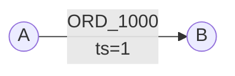
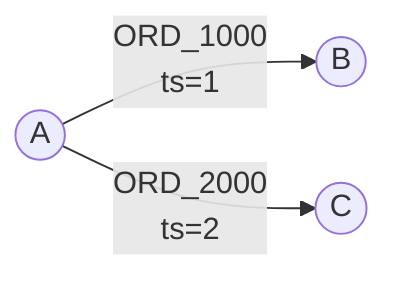
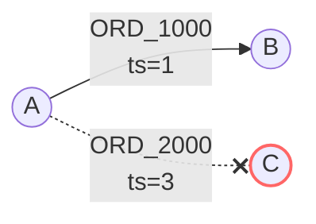
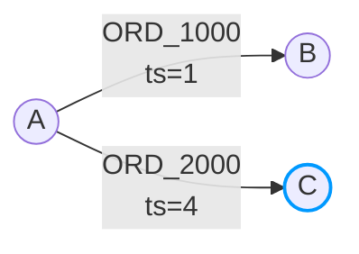

This document illustrates how data structures change with **multi-edges**.

| | [Both-Directed](/internals/explained/edge-both-directed/) | [Out-Directed](/internals/explained/edge-out-directed/) | Multi-Edge |
|---|---|---|---|
| **Direction** | BOTH | OUT | BOTH/OUT |
| **Index** | OUT + IN | OUT only | OUT + IN (by id) |
| **Key** | (source, target) | (source, target) | id |
| **Multiple edges per pair** | ❌ | ❌ | ✅ |
| **Use case** | Follows, friends | Recent views | Gifts, orders |

## Schema

```
[Table] order_v1
+---------+--------+----------+-----------+----------------+
| id      | source | target   | direction | index          |
+---------+--------+----------+-----------+----------------+
| orderId | userId | friendId | BOTH      | created_at_desc|
+---------+--------+----------+-----------+----------------+
```

- **id**: Unique identifier for each edge (e.g., order ID)
- **source**: User ID performing the action
- **target**: Friend ID receiving the gift
- **direction**: `BOTH` means both OUT and IN indexes are maintained
- **index**: `created_at_desc` orders edges by creation time (descending)

---

## Action 1: A gives a gift (ORD_1000) to B

A gives a gift with order ID `ORD_1000` to friend B at timestamp 1.



### Edge State

| source   | target   | active | version | properties                      | created_at | deleted_at |
|----------|----------|--------|---------|--------------------------------|------------|------------|
| ORD_1000 | ORD_1000 | true   | 1       | createdAt=1, _source=A, _target=B | 1          | null       |

### Edge Index

| source | direction | indexCode                    | target   | version |
|--------|-----------|------------------------------|----------|---------|
| A      | OUT       | -373869625 (created_at_desc) | ORD_1000 | 1       |
| B      | IN        | -373869625 (created_at_desc) | ORD_1000 | 1       |

### Edge Count

| source | direction | count |
|--------|-----------|-------|
| A      | OUT       | 1     |
| B      | IN        | 1     |

---

## Action 2: A gives a gift (ORD_2000) to C

A gives another gift with order ID `ORD_2000` to friend C at timestamp 2.



### Edge State

| source   | target   | active | version | properties                      | created_at | deleted_at |
|----------|----------|--------|---------|--------------------------------|------------|------------|
| ORD_1000 | ORD_1000 | true   | 1       | createdAt=1, _source=A, _target=B | 1          | null       |
| ORD_2000 | ORD_2000 | true   | 2       | createdAt=2, _source=A, _target=C | 2          | null       |

### Edge Index

| source | direction | indexCode                    | target   | version |
|--------|-----------|------------------------------|----------|---------|
| A      | OUT       | -373869625 (created_at_desc) | ORD_1000 | 1       |
| B      | IN        | -373869625 (created_at_desc) | ORD_1000 | 1       |
| A      | OUT       | -373869625 (created_at_desc) | ORD_2000 | 2       |
| C      | IN        | -373869625 (created_at_desc) | ORD_2000 | 2       |

### Edge Count

| source | direction | count |
|--------|-----------|-------|
| A      | OUT       | 2     |
| B      | IN        | 1     |
| C      | IN        | 1     |

---

## Action 3: A cancels the gift (ORD_2000) to C

A requests to cancel the gift `ORD_2000` at timestamp 3. The edge is marked as deleted.



### Edge State

| source   | target   | active | version | properties                               | created_at | deleted_at |
|----------|----------|--------|---------|------------------------------------------|------------|------------|
| ORD_1000 | ORD_1000 | true   | 1       | createdAt=1, _source=A, _target=B        | 1          | null       |
| ORD_2000 | ORD_2000 | false  | 3       | createdAt=null, _source=null, _target=null | 2          | 3          |

### Edge Index

| source | direction | indexCode                    | target   | version |
|--------|-----------|------------------------------|----------|---------|
| A      | OUT       | -373869625 (created_at_desc) | ORD_1000 | 1       |
| B      | IN        | -373869625 (created_at_desc) | ORD_1000 | 1       |
| ~~A~~  | ~~OUT~~   | ~~(deleted)~~                | ~~ORD_2000~~ | ~~-~~ |
| ~~C~~  | ~~IN~~    | ~~(deleted)~~                | ~~ORD_2000~~ | ~~-~~ |

### Edge Count

| source | direction | count |
|--------|-----------|-------|
| A      | OUT       | 1     |
| B      | IN        | 1     |
| C      | IN        | 0     |

---

## Action 4: A withdraws the cancellation of gift (ORD_2000)

A withdraws the cancellation request at timestamp 4. The edge is reactivated.



### Edge State

| source   | target   | active | version | properties                      | created_at | deleted_at |
|----------|----------|--------|---------|--------------------------------|------------|------------|
| ORD_1000 | ORD_1000 | true   | 1       | createdAt=1, _source=A, _target=B | 1          | null       |
| ORD_2000 | ORD_2000 | true   | 4       | createdAt=4, _source=A, _target=C | 4          | 3          |

### Edge Index

| source | direction | indexCode                    | target   | version |
|--------|-----------|------------------------------|----------|---------|
| A      | OUT       | -373869625 (created_at_desc) | ORD_1000 | 1       |
| B      | IN        | -373869625 (created_at_desc) | ORD_1000 | 1       |
| A      | OUT       | -373869625 (created_at_desc) | ORD_2000 | 4       |
| C      | IN        | -373869625 (created_at_desc) | ORD_2000 | 4       |

### Edge Count

| source | direction | count |
|--------|-----------|-------|
| A      | OUT       | 2     |
| B      | IN        | 1     |
| C      | IN        | 1     |

---

## Key Points

1. **Unique ID**: Each edge has a unique `id` that distinguishes it from other edges, even between the same (source, target) pair.

2. **Edge State Storage**: The `id` is stored in both source and target columns of Edge State. The actual source and target are stored in properties as `_source` and `_target`.

> **Note:** This storage structure is a result of extending the original unique-edge design to support multi-edge. By storing the `id` in both source and target columns, Actionbase maintains backward compatibility with the existing data structure while enabling multiple edges between the same entity pair.

3. **Index Target**: The index target column contains the edge `id`, not the actual target node. This allows efficient lookup by edge ID.

4. **Use Cases**: Multi-edge is ideal for scenarios where multiple interactions can occur between the same entities:
   - Gift records between users
   - Multiple orders from a user to a merchant
   - Message history between users

### Comparison with Unique Edge

| Aspect | Unique Edge | Multi-Edge |
|--------|-------------|------------|
| Edge identification | (source, target) | id |
| Multiple edges per pair | ❌ | ✅ |
| Edge State key | source + target | id |
| Index target | actual target | edge id |

For details on encoding, see [Data Encoding](/internals/encoding/).

