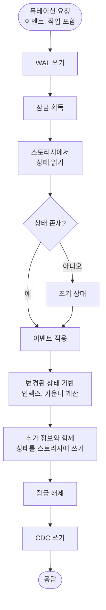

액션베이스의 뮤테이션을 사용하면 그래프 데이터베이스에서 정점과 엣지를 삽입, 업데이트 및 삭제할 수 있습니다. 뮤테이션 프로세스는 데이터 일관성, 내구성 및 쓰기 시점 최적화를 보장하기 위해 신중하게 조율된 순서를 따릅니다.

## 뮤테이션 흐름

다음 다이어그램은 전체 뮤테이션 프로세스를 보여줍니다:

## 뮤테이션 요청

뮤테이션 요청에는 다음이 포함됩니다:
- **Event**: 적용할 데이터 변경 사항 (예: 새 속성 값, 엣지 생성)
- **Operation**: 수행할 작업 유형:
  - **Insert**: 새 정점 또는 엣지 생성
  - **Update**: 기존 정점 또는 엣지 수정
  - **Delete**: 정점 또는 엣지 제거

## 뮤테이션 프로세스 단계

### 1. WAL 쓰기 (Write-Ahead Log)

스토리지에 변경 사항을 적용하기 전에, 뮤테이션이 먼저 Write-Ahead Log(WAL)에 기록됩니다. 이를 통해 내구성이 보장되고 실패 시 복구가 가능합니다. WAL은 실제 데이터에 적용되기 전의 모든 뮤테이션에 대한 영구 기록 역할을 합니다. 프로덕션 환경에서 액션베이스는 Kafka를 WAL 백엔드로 사용합니다.

### 2. 잠금 획득

동시 수정으로 인한 데이터 불일치를 방지하기 위해, 액션베이스는 뮤테이션되는 특정 엣지 또는 정점에 대한 잠금을 획득합니다. 이를 통해 한 번에 하나의 뮤테이션만 특정 데이터를 수정할 수 있습니다.

엣지의 경우, 잠금 메커니즘은 엣지 유형에 따라 다릅니다:
- **Unique 엣지**: (source, target) 쌍을 기반으로 잠금 획득
- **Multi 엣지**: 엣지 ID를 기반으로 잠금 획득

### 3. 상태 읽기

정점 또는 엣지의 현재 상태가 스토리지에서 읽혀집니다. 여기에는 엔티티와 관련된 모든 기존 속성, 타임스탬프 및 메타데이터가 포함됩니다.

### 4. 이벤트 적용 또는 상태 초기화

- **상태가 존재하는 경우**: 이벤트가 기존 상태에 적용되어 작업 유형에 따라 새 상태로 전환됩니다.
- **상태가 존재하지 않는 경우**: 초기 상태가 생성된 다음 이벤트가 적용됩니다.

이 단계는 메모리에서 실제 상태 전환을 수행합니다. 전환 동작은 작업 유형에 따라 다릅니다:

- **INSERT**: `createdAt` 타임스탬프를 업데이트하고 이벤트에서 속성을 설정합니다. `createdAt > deletedAt`일 때 상태가 활성화됩니다.
- **UPDATE**: 타임스탬프를 변경하지 않고 이벤트에 지정된 속성만 업데이트합니다.
- **DELETE**: `deletedAt` 타임스탬프를 업데이트하고 모든 속성을 삭제된 것으로 표시합니다. `deletedAt >= createdAt`일 때 상태가 비활성화됩니다.

전환은 버전 순서를 존중하며(새 버전이 이전 버전을 덮어씀) 상태 일관성을 유지합니다.

### 5. 추가 정보 계산 (쓰기 시점 최적화)

변경된 상태를 기반으로, 액션베이스는 빠른 읽기 작업을 가능하게 하는 추가 정보를 계산합니다:

- **인덱스**: 기존 인덱스가 삭제되고, 변경된 상태를 기반으로 새 인덱스 또는 업데이트된 인덱스가 생성됩니다
- **카운터**: 집계 통계를 유지하기 위해 카운트가 증가하거나 감소합니다

이 쓰기 시점 최적화는 쿼리 시점에 비용이 많이 드는 계산 없이 읽기 쿼리를 빠르게 응답할 수 있도록 보장합니다.

### 6. 추가 정보와 함께 상태 쓰기

수정된 상태와 모든 계산된 추가 정보(인덱스, 카운터 등)가 스토리지에 기록됩니다. 이 원자적 쓰기는 상태와 관련 최적화 데이터가 항상 일관성을 유지하도록 보장합니다.

### 7. 잠금 해제

쓰기가 완료되면 잠금이 해제되어 다른 뮤테이션이 동일하거나 다른 엔티티에서 진행할 수 있습니다.

### 8. CDC 쓰기 (Change Data Capture)

뮤테이션이 Change Data Capture(CDC) 시스템에 기록되어 다운스트림 시스템이 실시간으로 데이터 변경에 반응할 수 있게 합니다. 이는 뮤테이션 지연 시간에 영향을 주지 않도록 비동기적으로 수행됩니다. 프로덕션 환경에서 액션베이스는 Kafka를 CDC 백엔드로 사용합니다.

### 9. 응답

뮤테이션 작업이 완료되고 작업의 성공 또는 실패를 나타내는 응답과 뮤테이션에 대한 관련 메타데이터가 반환됩니다.

## 쓰기 시점 최적화

액션베이스의 쓰기 시점 최적화는 뮤테이션 중에 인덱스와 카운터를 사전 계산하는 핵심 기능입니다. 이 설계 선택은 다음과 같은 이점을 제공합니다:

- **빠른 읽기**: 읽기 작업이 비용이 많이 드는 쿼리 시점 계산 없이 빠르게 응답할 수 있음
- **일관된 성능**: 데이터 크기와 관계없이 읽기 지연 시간이 일관되게 낮게 유지됨 (`<5ms p99`)
- **효율적인 스토리지**: 인덱스와 카운터가 증분적으로 유지되어 전체 스캔을 방지함

쓰기 시점에 추가 정보를 계산함으로써, 액션베이스는 읽기 작업에서 쓰기 작업으로 계산 비용을 이동시켜 읽기 중심 워크로드에 이상적입니다.

## 일관성 보장

뮤테이션 프로세스는 다음을 통해 데이터 일관성을 보장합니다:

- **잠금**: 동일한 엔티티에 대한 동시 수정 방지
- **원자적 쓰기**: 상태와 추가 정보가 원자적으로 기록됨
- **WAL**: 내구성을 보장하고 복구를 가능하게 함
- **읽기-수정-쓰기**: 뮤테이션이 최신 상태를 기반으로 하도록 보장

