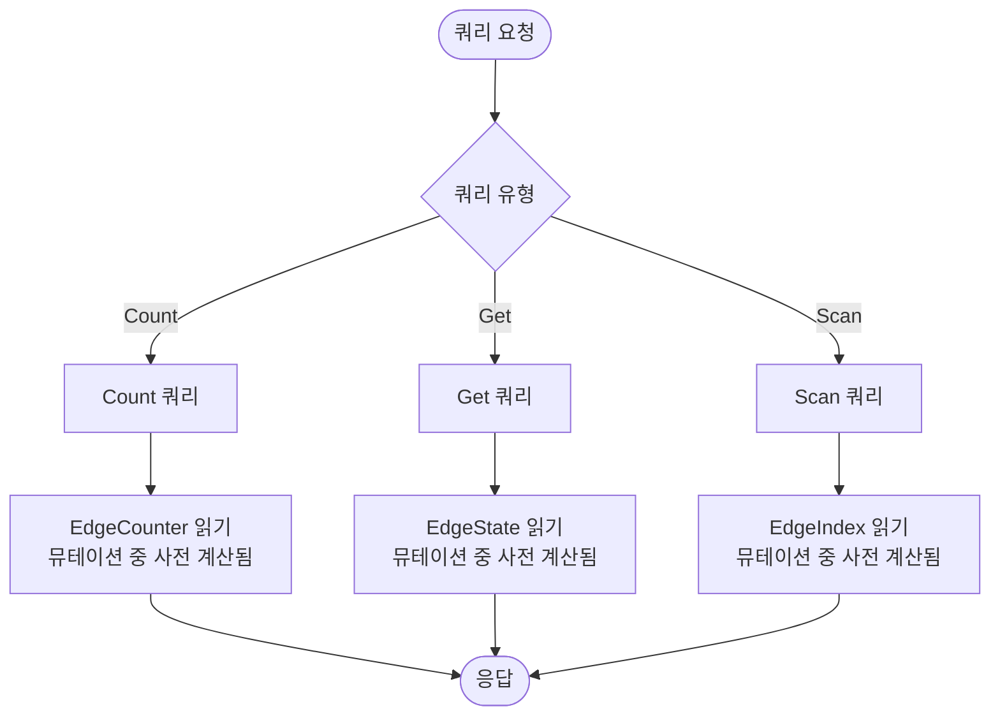

액션베이스의 쿼리는 뮤테이션 중에 사전 계산되고 최적화된 데이터를 조회합니다. 쿼리 시스템은 이러한 사전 계산된 구조에 직접 액세스하도록 설계되어 일관된 저지연으로 초고속 읽기 작업을 제공합니다.

## 쿼리 철학

액션베이스 쿼리는 뮤테이션 중에 생성된 최적화된 데이터 구조를 읽도록 설계되었습니다. 뮤테이션을 수행할 때, 액션베이스는 다음을 사전 계산합니다:

- **EdgeState**: 직접 조회를 위한 엣지의 현재 상태
- **EdgeIndex**: 효율적인 범위 스캔을 위한 정렬된 인덱스 항목
- **EdgeCounter**: 빠른 카운팅 작업을 위한 집계 카운트

쿼리는 이러한 사전 계산된 구조에 직접 액세스합니다. 쿼리 유형(Count, Get 또는 Scan)을 명시적으로 선택하고 사용할 인덱스를 지정하여, 각 쿼리가 쓰기 시점에 준비된 최적화된 경로를 따르도록 보장합니다.

## 쿼리 유형

액션베이스는 세 가지 유형의 엣지 쿼리를 지원하며, 각각 특정 사전 계산된 데이터 구조에 액세스하도록 설계되었습니다:

- **Count**: 사전 계산된 카운터에 액세스하여 엣지 개수 조회
- **Get**: 소스 및 타겟 노드 ID로 엣지 상태를 직접 조회
- **Scan**: 사전 계산된 인덱스를 사용하여 범위 필터링 및 페이지네이션으로 엣지 스캔

각 쿼리 유형은 액세스 패턴을 명시적으로 지정해야 하며, 이를 통해 쿼리가 뮤테이션 중에 생성된 최적화된 경로를 따르도록 보장합니다.

## 쿼리 흐름

다음 다이어그램은 쿼리가 사전 계산된 데이터에 액세스하는 방법을 보여줍니다:



## 쿼리 처리

### Count 쿼리

Count 쿼리는 뮤테이션 중에 유지된 사전 계산된 카운터 값을 읽습니다. 엣지가 생성되거나 삭제될 때, 해당 카운터가 자동으로 업데이트됩니다.

**처리 단계:**
1. 소스 노드, 테이블, 방향을 기반으로 EdgeCounter row key 구성
2. 스토리지에서 사전 계산된 카운터 값 조회
3. 범위가 지정된 경우, 인덱스 항목을 스캔하고 일치하는 엣지 개수 계산
4. 카운트 값 반환

**스토리지 액세스:**
- 뮤테이션 중에 생성된 **EdgeCounter** row type (Row Type Code: -2)에서 읽기
- 키 구조: `[hash] + [source] + [table] + [-2] + [direction]`
- 값: 증분적으로 유지되는 사전 계산된 엣지 개수

### Get 쿼리

Get 쿼리는 뮤테이션 중에 기록된 엣지 상태에 직접 액세스합니다. 각 뮤테이션이 EdgeState를 업데이트하며, Get 쿼리는 정확한 row key를 구성하여 이 상태를 조회합니다.

**처리 단계:**
1. 각 (source, target) 쌍에 대해 EdgeState row key 구성
2. 스토리지에서 엣지 상태 직접 조회
3. 선택적 필터를 조회된 엣지에 적용
4. 일치하는 엣지 반환

**스토리지 액세스:**
- 뮤테이션 중에 기록된 **EdgeState** row type (Row Type Code: -3)에서 읽기
- 키 구조: `[hash] + [source] + [table] + [-3] + [target]`
- 값: 속성, 버전, 타임스탬프를 포함한 엣지 상태 - 뮤테이션 중에 기록된 것과 정확히 동일

**MGet 지원:**
- 여러 소스 또는 타겟 ID가 지정되면, 작업이 다중 조회(mget)로 동작합니다
- API 요청당 최대 25개의 엣지를 조회할 수 있습니다
- 1개 소스와 N개 타겟, 또는 M개 소스와 1개 타겟 패턴을 지원합니다

### Scan 쿼리

Scan 쿼리는 뮤테이션 중에 생성된 사전 계산된 인덱스 항목을 사용합니다. 사용할 인덱스를 명시적으로 지정해야 하며, 쿼리는 엣지가 기록될 때 정렬되어 저장된 항목을 스캔합니다.

**처리 단계:**
1. 소스, 테이블, 방향 및 지정된 인덱스를 기반으로 EdgeIndex row key 접두사 구성
2. 인덱스 내에서 스캔 시작점과 끝점을 결정하기 위해 범위 필터 적용
3. 사전 계산된 인덱스 항목에 대한 범위 스캔 수행
4. 선택적 필터를 스캔된 결과에 적용
5. 지정된 경우 페이지네이션(limit, offset) 적용
6. 일치하는 엣지 반환

**스토리지 액세스:**
- 뮤테이션 중에 생성된 **EdgeIndex** row type (Row Type Code: -4)에서 읽기
- 키 구조: `[hash] + [source] + [table] + [-4] + [direction] + [index] + [index values] + [target]`
- 값: 엣지 버전 및 속성, 인덱스 정의를 기반으로 정렬된 순서로 저장됨

**인덱스 요구사항:**
- 쿼리에서 사용할 인덱스를 명시적으로 지정해야 합니다
- 인덱스는 테이블 메타데이터에 정의되어 있어야 합니다
- 인덱스 항목은 뮤테이션 중에 자동으로 생성되고 유지됩니다

## 사전 계산된 데이터 쿼리

액션베이스의 쿼리 성능은 뮤테이션 중에 최적화된 데이터 구조를 읽는 것에서 나옵니다. 이 설계는 다음을 의미합니다:

- **쿼리 시점 계산 없음**: 쿼리는 단순히 스토리지에서 사전 계산된 데이터를 조회합니다
- **명시적 액세스 패턴**: 쿼리 유형과 인덱스를 선택하여 쿼리가 준비된 경로를 따르도록 보장합니다
- **일관된 구조**: 쿼리하는 데이터 구조는 뮤테이션 중에 생성된 것과 정확히 동일합니다

### 이점

- **빠른 읽기**: 읽기 작업이 비용이 많이 드는 계산 없이 사전 계산된 데이터를 조회합니다
- **일관된 성능**: 데이터 크기와 관계없이 읽기 지연 시간이 일관되게 낮게 유지됩니다 (`<5ms p99`)
- **예측 가능한 성능**: 쿼리가 명시적이고 사전 계산된 경로를 따르기 때문에 성능이 예측 가능합니다

## 인덱스 범위

Scan 쿼리를 사용할 때, 데이터를 필터링하기 위해 범위를 지정할 수 있습니다. 범위는 사전 계산된 인덱스 구조와 함께 작동하여 스토리지 수준에서 효율적인 필터링을 가능하게 합니다.

### 핵심 개념

- **명시적 인덱스 사용**: 사용할 인덱스를 지정해야 하며, 범위는 해당 인덱스에 포함된 필드만 사용할 수 있습니다
- **인덱스 구조**: 범위는 뮤테이션 중에 생성된 인덱스 항목의 정렬된 구조를 활용합니다
- **연산자 의미**: 연산자(`eq`, `gt`, `lt`, `between`)는 정렬된 인덱스 내에서 스캔 시작점과 끝점을 결정합니다
- **인덱스 순서**: 복합 인덱스의 경우, 범위는 인덱스에 정의된 필드 순서대로 적용되어야 합니다
- **정렬 방향**: 연산자의 의미는 인덱스가 ASC(오름차순)인지 DESC(내림차순)인지에 따라 다릅니다

### 범위 vs 필터

- **범위**: 사전 계산된 인덱스 구조와 함께 작동하며, 인덱스된 필드를 사용하여 스토리지 수준에서 필터링합니다
- **필터**: 조회 후 적용되며, 모든 필드를 사용할 수 있지만 인덱스 최적화의 이점을 받지 못합니다

## 페이지네이션

Scan 쿼리는 `offset` 및 `limit` 파라미터를 통해 페이지네이션을 지원합니다:

- **offset**: 인덱스 내 시작 위치를 나타내는 인코딩된 문자열
- **limit**: 반환할 최대 결과 수 (기본값: 25)
- **hasNext**: 더 많은 결과가 사용 가능한지 여부를 나타내는 불리언

페이지네이션은 정렬된 인덱스 구조와 함께 작동하여 대규모 결과 집합의 효율적인 조회를 가능하게 합니다.

## 쿼리 방향

쿼리는 두 가지 방향을 지원합니다:

- **OUT**: 나가는 방향 (예: 사용자가 좋아한 제품 조회)
- **IN**: 들어오는 방향 (예: 제품을 좋아한 사용자 조회)

방향은 액세스되는 사전 계산된 데이터 구조를 결정합니다. 뮤테이션 중에 각 방향에 대해 별도의 인덱스 항목과 카운터가 유지되기 때문입니다.

## 읽기 경로

액션베이스의 전체 읽기 경로:

```
Client → Server → Engine → HBase → Response
```

1. **Client**: REST API를 통해 쿼리 요청 전송, 쿼리 유형 및 파라미터를 명시적으로 지정
2. **Server**: 요청 수신 및 검증
3. **Engine**: 쿼리 유형 및 파라미터를 기반으로 스토리지 키 구성, 그 다음 사전 계산된 데이터 조회
4. **HBase**: 뮤테이션 중에 생성된 사전 계산된 데이터 구조(EdgeState, EdgeIndex 또는 EdgeCounter) 반환
5. **Response**: 클라이언트에 형식화된 결과 반환

이 간단한 읽기 경로는 쓰기 시점에 최적화된 데이터 구조에 액세스하여 일관된 저지연 쿼리 성능을 보장합니다.

