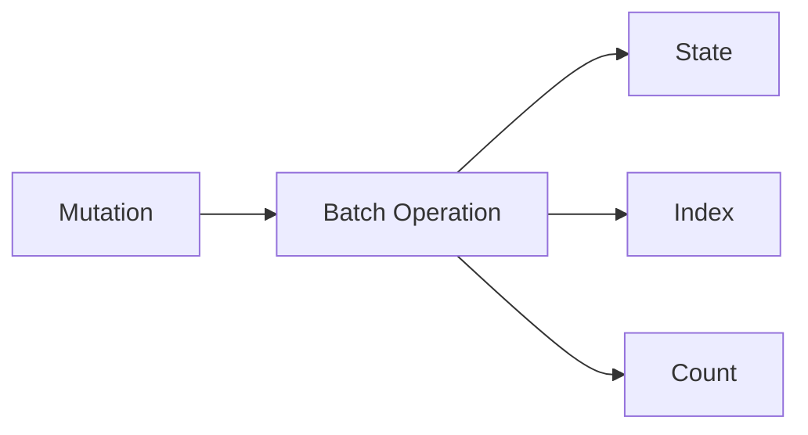
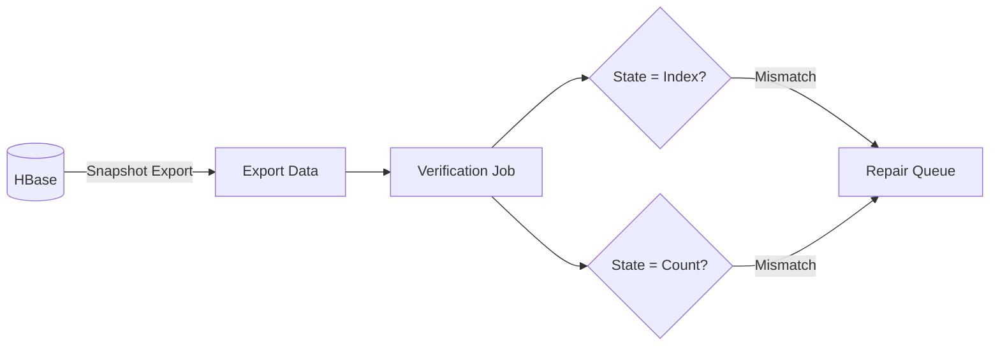

이 스토리는 **주기적 검증** 패턴을 보여줍니다: 운영 중 발생할 수 있는 데이터 불일치를 감지하고 보정하는 방법을 설명합니다.

## 도전 과제 {#the-challenge}

배포했습니다. 마이그레이션도 검증했습니다. 이제 운영만 하면 될까요?

아닙니다. 운영 중에도 데이터 불일치가 발생할 수 있습니다.

## 데이터 구조 {#data-structure}

Actionbase는 HBase에 세 가지 유형의 데이터를 저장합니다:

- **State**: 원천 데이터 - 실제 엣지 레코드
- **Index**: 효율적인 쿼리를 위한 파생 데이터
- **Count**: 파생된 집계 데이터

## 정합성 문제 {#consistency-problem}

HBase 뮤테이션은 State, Index, Count를 한 번의 배치 오퍼레이션으로 실행합니다. 하지만 리전 서버가 배치 중간에 실패하면? 네트워크 문제로 부분적인 쓰기가 발생하면?

일부는 갱신되고 일부는 갱신되지 않을 수 있습니다. State, Index, Count 간의 정합성이 깨지면 쿼리가 부정확한 결과를 반환합니다.

## 주기적 검증 {#periodic-verification}

배치가 항상 원자적으로 성공한다고 신뢰하지 않습니다. 대신 검증합니다.

HBase의 스냅샷 익스포트를 사용하여 주기적으로 모든 데이터를 추출하고 검증 작업을 실행합니다:

- **State vs Index**: 모든 state 레코드에 해당하는 인덱스 엔트리가 있어야 함
- **State vs Count**: 집계된 카운트가 실제 레코드 수와 일치해야 함

## 주기적 보정 {#periodic-correction}

불일치가 감지되면 보정합니다. State가 정답입니다. Index와 Count는 State로부터 재생성할 수 있습니다.

보정 주기는 서비스 SLA 요구사항에 따라 결정합니다.

## 우리가 배운 점 {#what-we-learned}

- **완벽한 원자성을 기대하지 않는다**. 분산 시스템에서 부분 실패는 발생합니다. 이를 감지하고 보정하는 메커니즘이 필요합니다.
- **State가 정답**. 파생 데이터(Index, Count)는 언제든 State로부터 재생성할 수 있도록 설계합니다.
