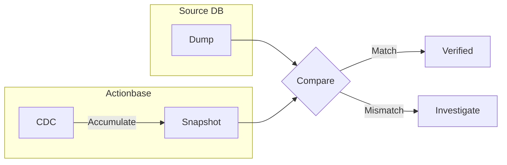

이 스토리는 **비교 검증** 패턴을 보여줍니다: 기존 시스템에서 Actionbase로 데이터를 마이그레이션할 때 정합성을 검증하는 방법을 설명합니다.

## 도전 과제 {#the-challenge}

기존 시스템에서 Actionbase로 데이터를 마이그레이션합니다. 데이터가 제대로 옮겨졌는지 어떻게 확신할 수 있을까요?

한 번에 모든 데이터를 이관하지 않습니다. 단계별로 검증하면서 진행합니다.

## 단계별 마이그레이션 {#staged-migration}

[카카오톡 선물하기 위시](/ko/stories/kakaotalk-gift-wish/)의 경우, 마이그레이션은 5개의 단계를 거쳤습니다. 각 단계는 다음 단계로 진행하기 전에 정합성 체크를 포함했습니다.

## 비교 검증 {#comparison-verification}

두 개의 데이터 소스를 비교합니다:

1. **Source DB Dump**: 원본 데이터베이스(MySQL 등)에서 직접 익스포트
2. **Actionbase CDC Snapshot**: Actionbase CDC의 "after" 값을 누적

둘이 일치하면 마이그레이션이 검증됩니다. 불일치가 발생하면 진행 전에 조사합니다.

## 왜 CDC Snapshot인가 {#why-cdc-snapshot}

Actionbase는 CDC(Change Data Capture)를 통해 모든 변경을 기록합니다. CDC의 "after" 값을 누적하면 현재 상태의 스냅샷을 만들 수 있습니다.

HBase를 직접 읽어서 비교할 수도 있습니다. 하지만 CDC Snapshot은 독립적인 경로로 만들어진 데이터입니다. Source DB → Actionbase → HBase → CDC → Snapshot. 이 전체 파이프라인이 정상 동작해야만 일치합니다.

## 우리가 배운 점 {#what-we-learned}

- **독립적인 소스로 검증**. 같은 데이터를 다른 경로로 만들어서 비교합니다. 일치하면 전체 파이프라인이 정상입니다.
- **단계별 진행**. 한 번에 모든 데이터를 이관하지 않습니다. 각 단계마다 검증하고 다음으로 진행합니다.
