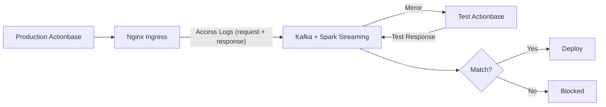
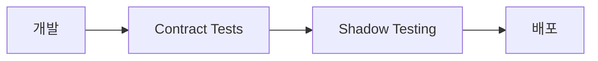

배포 전에 섀도우 테스트를 실행합니다. 이것이 최종 안전장치입니다.

## 동작 방식

1. **Capture**: Kubernetes Nginx Ingress가 모든 요청(바디와 응답 포함)을 Kafka로 기록
2. **Mirror**: 이 로그를 새 버전이 실행 중인 테스트 환경에 미러링
3. **Compare**: 결과를 프로덕션 응답과 비교
4. **Verify**: 데이터 정합성과 시스템 안정성이 확인된 경우에만 배포 진행

## 왜 필요한가

유닛 테스트와 통합 테스트가 놓치는 문제를 잡아냅니다. 실제 트래픽 패턴에서만 나타나는 엣지 케이스들입니다.

테스트 환경에서는 발견하기 어려운 문제들:

- 특정 데이터 조합에서만 발생하는 버그
- 트래픽 패턴에 따른 성능 문제
- 프로덕션 데이터 규모에서만 드러나는 이슈

## 배포 프로세스에서의 위치

- **Contract Tests**: 약속된 동작이 보존되는지 확인
- **Shadow Testing**: 실제 트래픽으로 최종 검증

두 단계를 모두 통과해야 배포가 진행됩니다.
