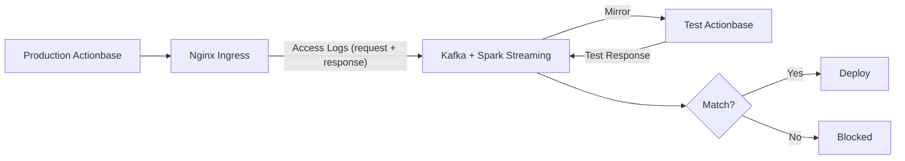
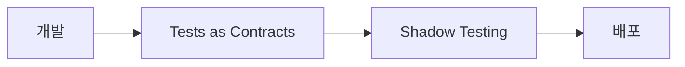

이 스토리는 **Shadow Testing** 패턴을 보여줍니다: 프로덕션 트래픽을 미러링하여 배포 전 최종 검증하는 방법을 설명합니다.

## 도전 과제 {#the-challenge}

[Tests as Contracts](/ko/stories/contracts/)를 통과했습니다. 그래도 불안합니다. 진짜 프로덕션 트래픽에서도 괜찮을까?

유닛 테스트, 통합 테스트, Tests as Contracts. 다 통과했습니다. 그래도 프로덕션에서 문제가 생깁니다. 실제 트래픽에서만 드러나는 것들이 있습니다:

- 특정 데이터 조합에서만 발생하는 버그
- 트래픽 패턴에 따른 성능 문제
- 프로덕션 데이터 규모에서만 드러나는 이슈

Contract에 명시되지 않은 동작을 사용하고 있을 수도 있습니다. 테스트 환경에서는 만들어내기 어려운 조건들입니다.

## 동작 방식 {#how-it-works}

배포 전에 Shadow Testing을 실행합니다. 실제 서비스 트래픽에는 영향을 주지 않습니다.

1. **Capture**: Kubernetes Nginx Ingress가 모든 요청(바디와 응답 포함)을 Kafka로 기록
2. **Mirror**: 이 로그를 새 버전이 실행 중인 테스트 환경에 미러링
3. **Compare**: 결과를 프로덕션 응답과 비교
4. **Verify**: 데이터 정합성과 시스템 안정성이 확인된 경우에만 배포 진행

## 배포 프로세스에서의 위치 {#deployment-process}

- **Tests as Contracts**: 약속된 동작이 보존되는지 확인
- **Shadow Testing**: 실제 트래픽으로 최종 검증

두 단계를 모두 통과해야 배포가 진행됩니다.

## 우리가 배운 점 {#what-we-learned}

- **실제 트래픽은 대체할 수 없다**. 아무리 정교한 테스트 시나리오도 실제 프로덕션 트래픽 패턴을 완벽히 재현하지 못합니다.
- **배포 전 마지막 안전장치**. Tests as Contracts와 Shadow Testing을 모두 통과해야 자신 있게 배포할 수 있습니다.
