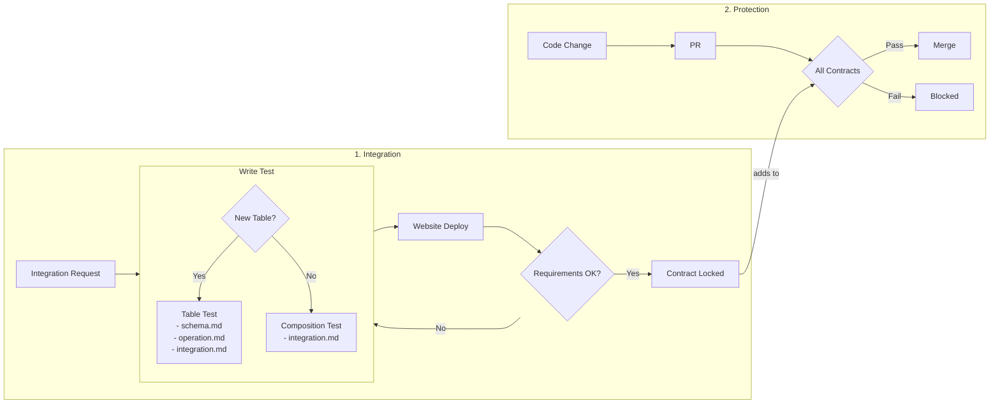

This story demonstrates the **Contract Testing** pattern: how Actionbase guarantees 100% contract coverage instead of 100% code coverage.

## What is Contract Testing?

Contract testing verifies that two systems agree on how they communicate. Traditionally, it checks API shape between services—request format, response structure, error codes. Tools like [Pact](https://docs.pact.io/) automate this between microservices.

But Actionbase isn't an API server. It's a database. We applied the same idea—with some adaptations.

## How It Works

### 1. Integration

When a service team requests integration:

1. **Integration Request** — They describe what they need. "We need the 10 most recent wishes for a user, sorted by timestamp descending."

2. **Write Test** — We write a scenario test together. Two types:
   - **Table Test** (new table) — Generates schema.md, operation.md, integration.md
   - **Composition Test** (existing tables) — Generates integration.md only

3. **Website Deploy** — The test generates MDX files. The website deploys with the new docs.

4. **Requirements OK?** — Service team reviews the docs. If not right, we iterate—back to Write Test. If good, we finalize.

5. **Contract Locked** — The contract is finalized. It joins All Contracts.

### 2. Protection

Once locked, contracts guard production:

1. **Code Change** — Someone changes Actionbase code.

2. **PR** — They open a pull request.

3. **All Contracts** — Every locked contract runs as a test.

4. **Pass → Merge** — All contracts pass, PR merges.

5. **Fail → Blocked** — Any contract fails, merge is blocked. Broken contracts don't ship.

## Why This Works

**Same table, different expectations.** One service expects the 10 most recent items. Another expects the 100 oldest. Some fetch a single edge, others batch-fetch hundreds. Each combination of index, direction, and limit is a separate contract.

**Tests replace docs.** The test generates the documentation. Schema, operations, API examples—all from the same test code. Documentation never goes stale because it's generated from the test that must pass.

**100% contract coverage.** Not 100% code coverage. We only test what we promise. And what we promise, we guarantee.

## What We Learned

- **Tests become integration documents.** No separate docs to maintain. The test is the spec.
- **Iteration before lock.** Requirements change during integration. The loop handles that.
- **Once locked, always protected.** Every PR runs every contract. Broken contracts don't ship.
