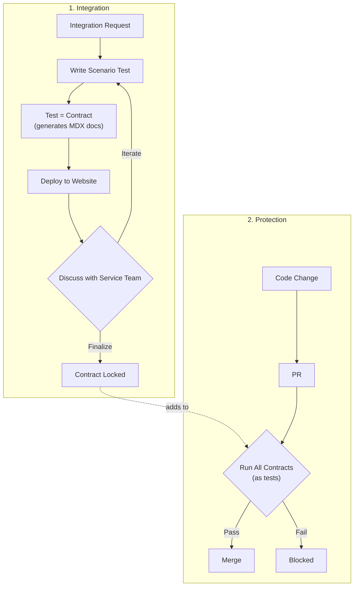

This story demonstrates the **Tests as Contracts** pattern: how Actionbase evolved continuously without ever breaking existing integrations.

## The Challenge

Contract Testing is a powerful idea: two systems should agree on how they communicate—and that agreement should be tested continuously.

In the microservice world, tools like [Pact](https://docs.pact.io/) apply this idea to APIs. A consumer defines what it expects. The provider verifies that it still satisfies those expectations. As long as the contract holds, teams can evolve independently without fear.

But Actionbase isn't an API server—it's a database with a REST interface. And databases introduce a very different kind of contract.

When a service integrates with a database, it doesn't just rely on data. It relies on behavior:

- "Give me the 10 most recent edges, sorted descending."
- "This query must be fast with this index."
- "Batch reads of 500 items must be stable."
- "This mutation pattern must never break."

These expectations are not captured by schemas alone.

We tried documenting them with Swagger. But as Actionbase evolved, the testing burden grew exponentially. Every new query capability multiplied the number of combinations to cover.

Testing everything wasn't realistic. Testing nothing wasn't acceptable. Traditional tests didn't help either—unit tests verify correctness in isolation, E2E tests verify happy paths, but neither guarantees: "This exact usage pattern will keep working forever."

That gap is where we applied the Contract Testing idea—with a twist.

## Contract Strategy

We kept the core insight: a contract is something you test continuously, not something you document once.

Then we asked a different question: what does a contract look like for a database?

Our answer: a real usage scenario. Not a schema file. Not an API definition. A scenario test that reflects how the system is actually used.

## How It Works

### 1. Integration: Tests Become Contracts

When a service team wants to integrate with Actionbase, the process starts with a concrete request:

"We need the 10 most recent wishes for a user, sorted by timestamp descending."

Instead of writing documentation, we write a scenario test together. That test defines:

- The schema (edges, properties, indexes)
- The mutations (create, update, delete)
- The queries (exact access patterns, limits, ordering)

This test is not an example. It is the contract.

From that test, documentation is generated automatically—schema definitions, API examples, query semantics. CI deploys the docs to our website. The service team reviews them. We iterate. We adjust the test. Writing the test is manual. Everything after that is automated.

Once everyone agrees, the contract is locked. At that moment, the test stops being just a test. It becomes a promise.

### 2. Protection: Locked Contracts Guard Production

Locked contracts never disappear. Every pull request to Actionbase runs all locked contracts.

- If every contract passes → the change ships.
- If even one fails → the change is blocked.

We don't ask: "Is this change reasonable?" We ask: "Does this break anything we promised?" If it does, it doesn't ship.

## Same Table, Different Contracts

One table can have many contracts—because the same data is used in different ways.

- One service reads the newest 10 items.
- Another scans the oldest 100.
- One fetches single edges.
- Another batch-fetches hundreds.

Each usage pattern is a separate contract. Each is protected independently. This is difficult to express with API-level contract testing, but for databases, it's essential.

## The Actionbase Approach

| Aspect               | Traditional (API Contract Testing) | Actionbase (Tests as Contracts) |
| -------------------- | ---------------------------------- | ------------------------------- |
| **Target System**    | API server ↔ API consumer          | Database ↔ service teams        |
| **Contract Scope**   | Request/response shape             | Usage patterns                  |
| **Contract Format**  | Pact files (JSON)                  | Scenario test code              |
| **Documentation**    | Separate                           | Generated from tests (MDX)      |
| **Doc Freshness**    | Can drift                          | Always current                  |
| **Contract Storage** | Pact Broker                        | Test suite                      |
| **Evolution Model**  | Version negotiation                | Cumulative, forever             |
| **Failure Meaning**  | Consumer incompatibility           | Broken promise                  |

### What Makes This Different

**Contracts describe usage, not interfaces.** The promise isn't "this API returns JSON." It's "this access pattern will always work."

**Test = Spec = Doc = Guard.** This is the key insight. One source of truth. Nothing drifts. Nothing is assumed.

**What we promise, we guarantee.** If it's not a contract, it's not guaranteed. If it is a contract, it is guaranteed—100%.

## What We Learned

- **Contracts are promises, not documents.** Every integration is a promise. Tests enforce that promise on every PR.
- **Evolving systems need guardrails.** Actionbase was never finished—new features, new optimizations, new storage backends. But every change was safe because every promise was tested.
- **Tests as Contracts enables fearless evolution.** That's how we built a system that grows without breaking.
