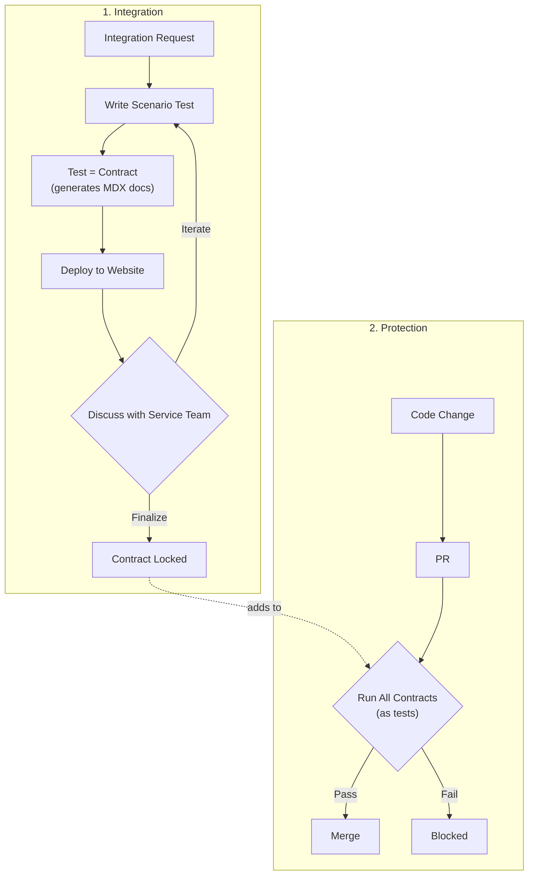

This story demonstrates the **Tests as Contracts** pattern: how Actionbase evolved continuously without ever breaking existing integrations.

## What Is Tests as Contracts?

**Test = Spec = Doc = Guard.** One source of truth.

When a service team integrates with Actionbase, we don't write documentation. We write a scenario test together. That test:

- Defines the contract (schema, mutations, queries)
- Generates documentation automatically
- Runs on every PR to guard production

If the test passes, the promise holds. If it fails, the change is blocked. What we promise, we guarantee—100%.

## Why We Needed This

Contract Testing is a powerful idea: two systems should agree on how they communicate—and that agreement should be tested continuously. In the microservice world, tools like [Pact](https://docs.pact.io/) apply this to APIs.

But Actionbase isn't an API server—it's a database with a REST interface. And databases introduce a very different kind of contract.

When a service integrates with a database, it doesn't just rely on data. It relies on behavior:

- "Give me 100 items at once" vs "give me 10 at a time, paginated"
- "Scan the full index" vs "scan with a specific filter"
- "Find who I follow" vs "find who follows me"
- "Write one item" vs "write 10 items in a batch" vs "write items that might conflict"
- "I need strong consistency" vs "eventual consistency is fine"

We tried documenting these with Swagger. But as Actionbase evolved, the testing burden grew exponentially. Every new query capability multiplied the number of combinations to cover.

Testing everything wasn't realistic. Testing nothing wasn't acceptable. Traditional tests didn't help either—unit tests verify correctness in isolation, E2E tests verify happy paths, but neither guarantees: "This exact usage pattern will keep working forever."

That gap is where we applied the Contract Testing idea—with a twist. Instead of testing every possible combination, we test what's actually promised.

## How It Works

### 1. Integration: Tests Become Contracts

When a service team wants to integrate with Actionbase, the process starts with a concrete request:

"We need the 10 most recent wishes for a user, sorted by timestamp descending."

Instead of writing documentation, we write a scenario test together. That test defines:

- The schema (edges, properties, indexes)
- The mutations (create, update, delete)
- The queries (exact access patterns, limits, ordering)

This test is not an example. It is the contract.

From that test, documentation is generated automatically—schema definitions, API examples, query semantics. CI deploys the docs to our website. The service team reviews them. We iterate. We adjust the test. Writing the test is manual. Everything after that is automated.

Once everyone agrees, the contract is locked. At that moment, the test stops being just a test. It becomes a promise.

### 2. Protection: Locked Contracts Guard Production

Locked contracts never disappear. Every pull request to Actionbase runs all locked contracts.

- If every contract passes → the change ships.
- If even one fails → the change is blocked.

We don't ask: "Is this change reasonable?" We ask: "Does this break anything we promised?" If it does, it doesn't ship.

### Same Table, Different Contracts

One table can have many contracts—because the same data is used in different ways. One service needs 100 items at once. Another paginates 10 at a time. One needs strong consistency. Another is fine with eventual consistency.

Each usage pattern is a separate contract. Each is protected independently.

## The Actionbase Approach

| Aspect             | Traditional                  | Actionbase                           |
| ------------------ | ---------------------------- | ------------------------------------ |
| **Contract Scope** | API shape (request/response) | Usage patterns                       |
| **Documentation**  | Separate, can drift          | Generated from tests, always current |
| **Evolution**      | Version negotiation          | Cumulative, forever                  |
| **Failure**        | Consumer incompatibility     | Broken promise → blocked             |

## What We Learned

- **Contracts are promises, not documents.** Every integration is a promise. Tests enforce that promise on every PR.
- **Evolving systems need guardrails.** Actionbase was never finished—new features, new optimizations, new storage backends. But every change was safe because every promise was tested.
- **Tests as Contracts enables fearless evolution.** That's how we built a system that grows without breaking.
