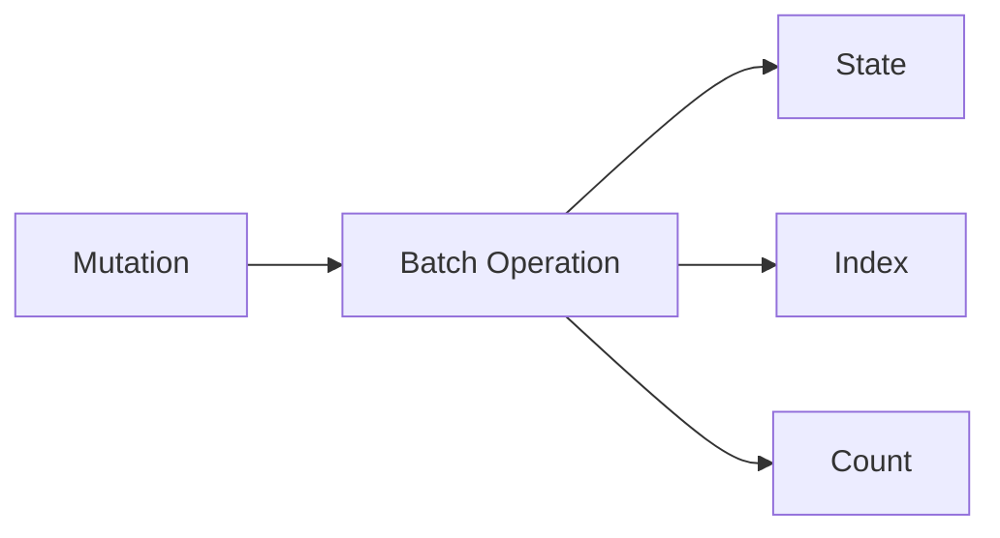
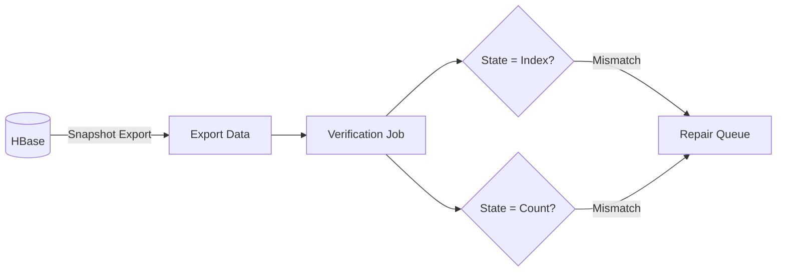

How we detect and correct data inconsistencies that can occur during Actionbase operations.

## Data Structure

Actionbase stores three types of data in HBase:

- **State**: The source of truth—the actual edge records
- **Index**: Derived data enabling efficient queries
- **Count**: Derived aggregations

## The Consistency Challenge

HBase mutations execute State, Index, and Count together in a single batch operation. But what happens when a region server fails mid-batch? Or network issues cause partial writes?

The result: Some may update while others don't. When consistency between State, Index, and Count breaks, queries return incorrect results.

## Periodic Verification

We don't trust that batches always succeed atomically. Instead, we verify:

Using HBase's snapshot export, we periodically extract all data and run verification jobs:

- **State vs Index**: Every state record should have corresponding index entries
- **State vs Count**: Aggregated counts should match actual record counts

## Periodic Correction

Mismatches are detected and periodically corrected according to service SLA requirements.

State is the source of truth. Index and Count can be regenerated from State.
