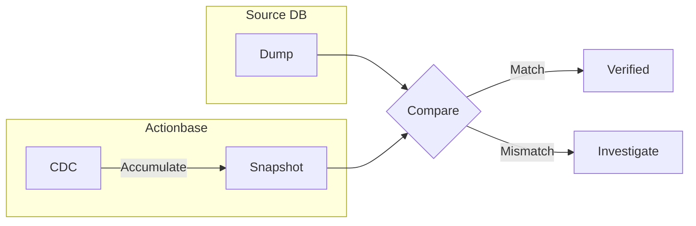

When migrating data from existing systems to Actionbase, we verify at every step.

## Staged Migration

For the [KakaoTalk Gift Wish](/stories/kakaotalk-gift-wish/) feature, migration proceeded through 5 distinct stages. Each stage included integrity checks before proceeding to the next.

We don't migrate all data at once. We verify at each stage as we proceed.

## Comparison Verification

We compare two data sources:

1. **Source DB Dump**: Direct export from source database (MySQL, etc.)
2. **Actionbase CDC Snapshot**: Accumulated "after" values from Actionbase CDC

If both match, migration is verified. Any mismatch triggers investigation before proceeding.

## Why CDC Snapshot

Actionbase records all changes through CDC (Change Data Capture). By accumulating the "after" values from CDC, we can create a snapshot of the current state.

Benefits of this approach:

- Can verify with an independent source
- Can compare directly with Source DB
- Proves accuracy of the migration process
