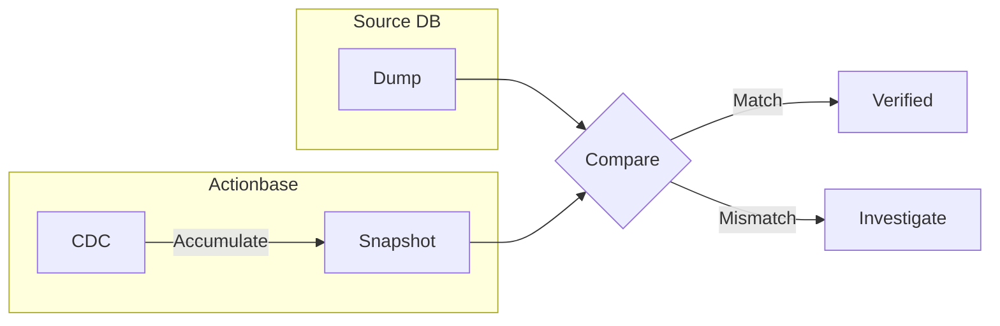

This story demonstrates the **Comparison Verification** pattern: how to verify data integrity when migrating data from existing systems to Actionbase.

## The Challenge {#the-challenge}

Migrating data from existing systems to Actionbase. How can we be confident the data was transferred correctly?

We don't migrate all data at once. We verify at each stage as we proceed.

## Staged Migration {#staged-migration}

For [KakaoTalk Gift Wish](/stories/kakaotalk-gift-wish/), migration proceeded through 5 distinct stages. Each stage included integrity checks before proceeding to the next.

## Comparison Verification {#comparison-verification}

We compare two data sources:

1. **Source DB Dump**: Direct export from source database (MySQL, etc.)
2. **Actionbase CDC Snapshot**: Accumulated "after" values from Actionbase CDC

If both match, migration is verified. Any mismatch triggers investigation before proceeding.

## Boundary Handling {#boundary-handling}

Boundary data exists at verification time. The timestamps of Source DB Dump and CDC Snapshot don't align exactly.

Boundary data is excluded from the current verification window. If the verification window is `T-1` day 00:00 ~ 23:59, boundary data is included in the next window `T`. As the window slides, all data eventually gets verified.

## Why CDC Snapshot {#why-cdc-snapshot}

Actionbase records all changes through CDC (Change Data Capture). By accumulating the "after" values from CDC, we can create a snapshot of the current state.

We could also read HBase directly and compare. But CDC Snapshot is data created through an independent path. Source DB → Actionbase → HBase → CDC → Snapshot. Only if this entire pipeline works correctly will they match.

## What We Learned {#what-we-learned}

- **Verify with independent sources**. Create the same data through different paths and compare. If they match, the entire pipeline is working correctly.
- **Progress in stages**. Don't migrate all data at once. Verify at each stage before proceeding to the next.
