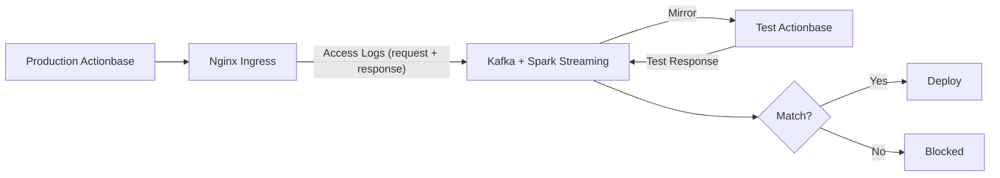
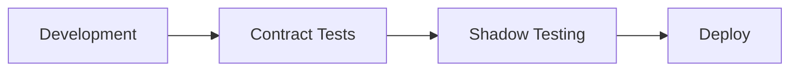

Before any deployment, we run shadow tests. This is the final safety net.

## How It Works

1. **Capture**: Kubernetes Nginx Ingress logs all requests (including body and response) to Kafka
2. **Mirror**: These logs are mirrored to the test environment running the new version
3. **Compare**: Results are compared against production responses
4. **Verify**: Only if data integrity and system stability are confirmed does deployment proceed

## Why It's Needed

Shadow testing catches issues that unit tests and integration tests miss—the edge cases that only appear in real traffic patterns.

Problems that are hard to find in test environments:

- Bugs that only occur with specific data combinations
- Performance issues dependent on traffic patterns
- Issues that only surface at production data scale

## Position in Deployment Process

- **Contract Tests**: Verify promised behaviors are preserved
- **Shadow Testing**: Final verification with real traffic

Deployment proceeds only after passing both stages.
