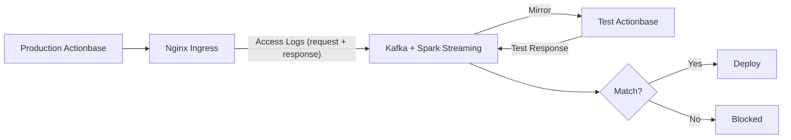
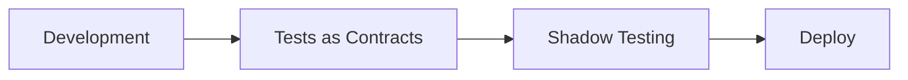

This story demonstrates the **Shadow Testing** pattern: how to perform final verification before deployment by mirroring production traffic.

## Why We Needed This {#why-we-needed-this}

[Tests as Contracts](/stories/contracts/) passed. But there are areas tests can't cover:

- Bugs that only occur with specific data combinations
- Performance issues dependent on traffic patterns
- Issues that only surface at production data scale
- Clients using behaviors not specified in contracts

These are conditions you can't create in test environments.

## How It Works {#how-it-works}

Nginx Ingress in front of production Actionbase logs all requests and responses as Access Logs. We mirror these logs and replay them against the new version. Since it's log-based, there's no impact on live service traffic.

1. **Capture**: Kubernetes Nginx Ingress logs all requests and responses to Kafka
2. **Mirror**: Mirrored to test environment running the new version
3. **Compare**: Compare with production responses
4. **Verify**: Deploy if match, block if mismatch

## Deployment Process {#deployment-process}

Both stages must pass before deployment proceeds.

## What We Learned {#what-we-learned}

- **Real traffic is irreplaceable.** No matter how sophisticated test scenarios are, they can't perfectly reproduce production traffic patterns.
- **Final gate before deployment.** Both Tests as Contracts and Shadow Testing must pass before deployment.
