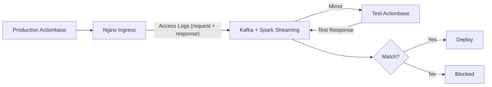
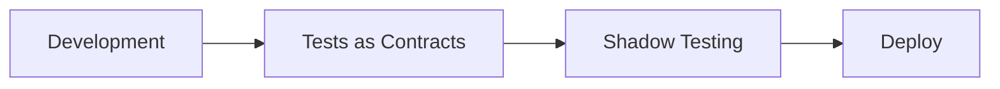

This story demonstrates the **Shadow Testing** pattern: how to perform final verification before deployment by mirroring production traffic.

## The Challenge {#the-challenge}

[Tests as Contracts](/stories/contracts/) passed. Still anxious. Will it really be okay with actual production traffic?

Unit tests, integration tests, contract tests. All passed. Yet problems still occur in production. Some things only surface in real traffic:

- Bugs that only occur with specific data combinations
- Performance issues dependent on traffic patterns
- Issues that only surface at production data scale

Services might also be relying on behaviors not covered by contracts. These are conditions that are hard to create in test environments.

## How It Works {#how-it-works}

Before deployment, we run Shadow Testing. It has no impact on production traffic.

1. **Capture**: Kubernetes Nginx Ingress logs all requests (including body and response) to Kafka
2. **Mirror**: These logs are mirrored to the test environment running the new version
3. **Compare**: Results are compared against production responses
4. **Verify**: Only if data integrity and system stability are confirmed does deployment proceed

## Position in Deployment Process {#deployment-process}

- **Tests as Contracts**: Verify promised behaviors are preserved
- **Shadow Testing**: Final verification with real traffic

Deployment proceeds only after passing both stages.

## What We Learned {#what-we-learned}

- **Real traffic is irreplaceable**. No matter how sophisticated test scenarios are, they cannot perfectly reproduce actual production traffic patterns.
- **Final safety net before deployment**. Passing both Tests as Contracts and Shadow Testing gives confidence to deploy.
